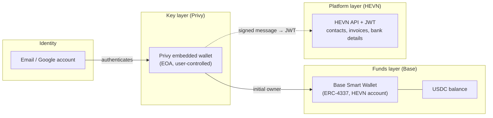
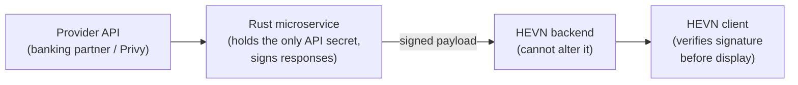

HEVN is built as four independent layers. Each layer has a strictly limited set of powers, and the layers that HEVN operates can never reach the layer where money lives.

## Layer 1 — Identity: email

The root of every HEVN account is the user's email address (or the Google account behind it). There are no seed phrases to write down and no browser extensions to install. Access to the account requires proving control of the email — and, once [wallet MFA](/general/privy-wallets#wallet-mfa-passkeys-and-otp) is enrolled, a second factor on top of it.

## Layer 2 — Keys: Privy embedded wallet

Authentication with that email through [Privy](https://docs.privy.io/wallets/overview/embedded) gives the user a **self-custodial embedded wallet** — an EOA whose private key is split with Shamir's Secret Sharing and reassembled only inside the user's own session, backed by trusted execution environments (TEEs). Neither Privy nor HEVN ever sees the key.

The mapping from email to Privy wallet is deterministic: one email ↔ one wallet. Details in [Key management with Privy](/general/privy-wallets).

## Layer 3 — Funds: Base Smart Wallet

HEVN does not operate on the Privy EOA directly. Instead, each Privy wallet is the **initial owner** — and the only one, until the user deliberately [adds others](/general/shared-access) — of an [ERC-4337 smart contract wallet](https://docs.base.org/base-account/overview/what-is-base-account) on Base. This smart wallet *is* the HEVN account:

- All balances are held here, as USDC on Base.
- All deposit details (crypto addresses, virtual bank details) resolve to this address.
- Its address is computed deterministically (via `CREATE2`) from the owner key, so it is known before it is ever deployed onchain.

Why a smart wallet instead of the raw EOA:

1. **Gasless USDC** — an ERC-4337 paymaster sponsors gas, so users transact in USDC without ever holding ETH.
2. **Multi-user access** — the wallet's `MultiOwnable` contract lets the user grant and revoke additional owners onchain. See [Shared account access](/general/shared-access).
3. **Deterministic addresses** — counterfactual deployment means send-by-email is safe even for recipients who haven't signed up yet.

Details in [Base smart wallets](/general/smart-wallets).

## Layer 4 — Platform: HEVN API

The user proves control of their Privy wallet by signing a message (standard web3 login). HEVN verifies the signature and issues its own JWT.

<Warning>
  The HEVN JWT **cannot move money**. It only authorizes platform features: contact books, invoices, contracts, bank detail issuance, KYC, statements, analytics. Spending funds always requires a signature from a key with onchain spending rights — the owner's key, or an [API key acting within an owner-granted spend allowance](/general/authentication#api-keys-cli-rest-api-agents).
</Warning>

Details in [Authentication](/general/authentication).

## Provider isolation: signed responses

Integrations with external providers — the banking partners and Privy — do not live in the main backend. Each provider is wrapped by its own **small Rust microservice**, and those services are the only place the provider's API secrets exist (delivered via AWS secret management; the monolith never sees them).

More importantly, these services **sign what they return**. Payout details, one-time deposit addresses, and transfer execution instructions are fetched from the provider by the microservice itself and returned with an Ed25519 signature. HEVN clients verify every such payload against the service's public key before displaying or acting on it.

This removes the main backend from the trust path for destination addresses: a compromised monolith can delay or drop data, but it cannot **substitute** a payout address or bank details — the forged payload would fail signature verification on the client. The same applies to identity: Privy wallet activation and email → address resolution run through a dedicated microservice with a strict change-freeze policy, so the deterministic mapping cannot be quietly altered by a routine deploy.

Independent audits of these microservices are planned. Beyond that, the roadmap is to move them into **trusted execution environments (TEEs)** and certify the source code through TEE attestation — so that a signed response provably originates from the exact audited build running in isolated hardware, verifiable by anyone rather than taken on trust.

## The deterministic chain

Every link in `email → Privy wallet → smart wallet` is deterministic. Consequences:

- **Send by email is safe.** HEVN computes the recipient's future smart wallet address from their email and sends funds directly there. No custody, no escrow, no claim step where HEVN holds the money.
- **Nothing to lose.** The account can always be re-derived from the email identity; there is no state that exists only on one device.
- **Verifiable.** Anyone can check onchain that a given smart wallet is owned by a given Privy address, and audit every transaction on [Base](https://basescan.org).

## Who can do what

| Action | User (email + Privy) | HEVN platform | Banking partner | 1Click / NEAR Intents |
| --- | --- | --- | --- | --- |
| Spend funds from the smart wallet | ✅ (signature required) | ❌ | ❌ | ❌ |
| Add / remove wallet owners | ✅ (onchain) | ❌ | ❌ | ❌ |
| Freeze or seize the balance | ❌ | ❌ | ❌ | ❌ |
| Create invoices, contacts, bank details | ✅ via JWT | issues on request | — | — |
| Execute a fiat payout | initiates & funds | orchestrates metadata | receives to one-time address, pays out fiat | — |
| Swap cross-chain | initiates & funds | requests quote | — | executes via one-time deposit address |

Teammates and API keys the owner has explicitly granted access to act within their own lane: full co-owners sign like the user; limited spenders (including API keys) are capped by their onchain [spend permission](/general/shared-access#limited-access-spend-permissions).
