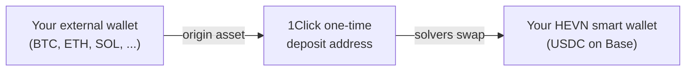
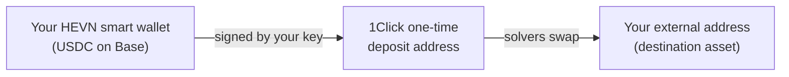

HEVN accounts hold USDC on Base, but users can deposit from and withdraw to many other chains and tokens (BTC, ETH, SOL, TRON-USDT, and more). This is powered by **[NEAR Intents](https://docs.near-intents.org/)** through its **[1Click API](https://docs.near-intents.org/integration/distribution-channels/1click-api/about-1click-api)**.

## What NEAR Intents / 1Click is

NEAR Intents is a cross-chain settlement protocol where users express an *intent* ("swap X on chain A for Y on chain B") and independent **market makers (solvers)** compete to fill it at the best price. 1Click is the REST distribution layer on top of it: it abstracts intent creation, solver coordination, settlement tracking, and refunds behind a simple quote → deposit → receive flow.

The canonical flow:

<Steps>
  <Step title="Quote">
    1Click returns a firm quote and a **one-time deposit address** on the origin chain, plus the exact amount that will be received on the destination chain.
  </Step>
  <Step title="Deposit">
    The sender transfers the origin asset to that address. The swap starts automatically once the deposit is confirmed on the origin chain — hence "passive deposit": no approvals, no contract calls, no wallet connection to a third-party dapp.
  </Step>
  <Step title="Settlement">
    Solvers fill the intent; 1Click tracks settlement and delivers the destination asset directly to the destination address from the quote.
  </Step>
  <Step title="Refund path">
    If a swap cannot complete (e.g. the quote expires or the deposit mismatches), 1Click handles the refund back to the sender's refund address.
  </Step>
</Steps>

## How HEVN uses it

**Depositing from another chain:**

**Withdrawing to another chain:**

In both directions the pattern is `crypto → smart wallet → crypto`: the fixed endpoint on the HEVN side is always the user's own [Base Smart Wallet](/general/smart-wallets), and the withdrawal leg out of it is signed by the user's key.

## Why this is safe

- **HEVN does not operate the deposit addresses.** One-time addresses are generated and managed by the 1Click service, not by HEVN. HEVN requests quotes and displays them — it cannot redirect or intercept funds in flight.
- **Quotes are firm.** The destination address and amount are fixed in the quote before any funds move; the destination for deposits is your own smart wallet address, which you can check yourself. The HEVN client additionally validates every displayed deposit address against the 1Click quote it came from.
- **One-time, single-purpose addresses.** Each address maps to exactly one quote, eliminating misattribution and pooled-fund risk.
- **Competitive execution.** Pricing comes from market makers competing in an open protocol rather than a single counterparty's desk. See [1Click fee mechanics](https://docs.near-intents.org/near-intents/integration/distribution-channels/1click-app-fees-calculation).
- **Failure means refund, not loss.** Expired or failed intents follow 1Click's refund flow back to the sender — for withdrawals, straight back to your HEVN smart wallet. While an intent is in flight, settlement is the 1Click service's responsibility: this is a deliberate, bounded trust assumption on the provider, scoped to one swap at a time.

<Note>
  As with [fiat payouts](/general/deposits-and-payouts), HEVN's role in a cross-chain swap is metadata only: requesting the quote, showing the address, and tracking status. The funds move directly between your wallets and the 1Click settlement layer.
</Note>

## References

- [NEAR Intents documentation](https://docs.near-intents.org/)
- [About the 1Click API](https://docs.near-intents.org/integration/distribution-channels/1click-api/about-1click-api)
