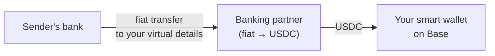
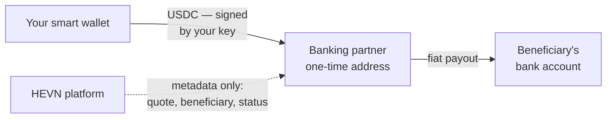

Every funding rail in HEVN resolves to the same place: the user's own [Base Smart Wallet](/general/smart-wallets). HEVN issues details, orchestrates metadata, and shows status — but it is never a party in the money flow.

## Deposits

### Bank details are bound to your wallet

When HEVN issues bank details (virtual account numbers / IBANs) for a user, those details are linked **only to that user's smart wallet address**. An incoming fiat transfer is converted by the banking partner and settles as USDC directly on the user's wallet.

<Note>
  HEVN does not maintain an omnibus account that receives deposits and later credits users. There is no internal balance to reconcile — the deposit *is* the onchain arrival of USDC at your address.
</Note>

### Direct crypto deposits

USDC on Base can be sent straight to the smart wallet address shown in the app — it's a normal onchain transfer to an address only you own. Because smart wallet addresses are [deterministic](/general/smart-wallets#deterministic-counterfactual-addresses), the address is valid even before the wallet contract is deployed.

### Deposits from other chains and tokens

Deposits in other cryptocurrencies are routed through the [NEAR Intents 1Click API](/general/cross-chain): you send to a one-time passive deposit address, and the swapped USDC is delivered to your smart wallet. HEVN does not operate those deposit addresses.

## Fiat payouts

Sending money to external bank details works in the opposite direction, and again keeps HEVN out of the flow:

<Steps>
  <Step title="You request a payout">
    Via the app, CLI, or API you create a payout to a bank beneficiary. This is a platform (JWT / API key) action — it produces a quote, not a money movement.
  </Step>
  <Step title="The banking partner issues a one-time crypto address">
    The licensed banking partner returns a **single-use deposit address** dedicated to this specific payout.
  </Step>
  <Step title="You send the funds yourself">
    The transfer of USDC from your smart wallet to that address is signed by **your** key. HEVN cannot initiate it, cannot alter the destination, and never takes possession of the funds.
  </Step>
  <Step title="The partner executes the fiat leg">
    On receiving the USDC, the banking partner performs the offramp and pays out to the beneficiary's bank account under its own licensing and compliance framework.
  </Step>
</Steps>

<Warning>
  At no point in a payout does HEVN receive, forward, or custody the money. The flow is strictly: **your wallet → banking partner's one-time address → beneficiary's bank**. HEVN's role is limited to metadata: quotes, beneficiary records, invoices, and status tracking.
</Warning>

## Why one-time addresses matter

- **Attribution** — a dedicated address maps one deposit to one payout, with no ambiguity about whose money arrived.
- **No standing honeypot** — there is no long-lived pooled address accumulating user funds.
- **Auditability** — each leg of the payout is an ordinary, publicly verifiable transaction on [Base](https://basescan.org).
