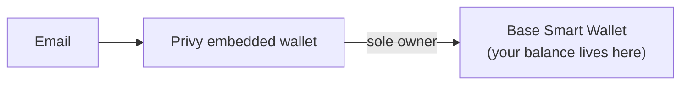

The HEVN platform does not operate on the user's Privy EOA directly. Each account is a **smart contract wallet on Base**, built on Coinbase's open-source, audited [Smart Wallet](https://github.com/coinbase/smart-wallet) contracts — the same contracts behind [Base Account](https://docs.base.org/base-account/overview/what-is-base-account).

The user's Privy wallet is the **initial and sole owner** of the smart wallet. Only owner signatures can authorize spending; HEVN holds no owner key.

## What the smart wallet gives you

<CardGroup cols={2}>
  <Card title="Gasless USDC" icon="fuel" href="#gasless-usdc-transactions">
    Transact entirely in USDC — a paymaster sponsors gas, no ETH ever needed.
  </Card>
  <Card title="Deterministic addresses" icon="hash" href="#deterministic-counterfactual-addresses">
    Your address is known before deployment — send-by-email is safe by construction.
  </Card>
  <Card title="Shared access" icon="users" href="#native-multi-user-access">
    Add co-owners or grant exact spend allowances, all enforced onchain.
  </Card>
  <Card title="Idempotent transfers" icon="repeat-1" href="#idempotent-transfers-no-double-sends">
    Every operation executes exactly once — a payout can never be sent twice.
  </Card>
</CardGroup>

All four are properties of the [ERC-4337](https://eips.ethereum.org/EIPS/eip-4337) account-abstraction standard and Coinbase's wallet contracts — not HEVN-side logic that you would have to trust.

## Gasless USDC transactions

Smart wallets follow [ERC-4337 account abstraction](https://eips.ethereum.org/EIPS/eip-4337): instead of raw transactions, they execute *user operations* that can be sponsored by a **paymaster**. HEVN sponsors gas through a paymaster (see [Coinbase Developer Platform Paymaster](https://docs.cdp.coinbase.com/paymaster/docs/welcome)), so users:

- transact entirely in USDC,
- never need to buy or hold ETH,
- never see a "gas" concept at all.

Sponsoring gas gives HEVN **no control** over the wallet — a paymaster only pays fees; it cannot initiate or modify operations.

## Deterministic (counterfactual) addresses

Smart wallet addresses are computed with `CREATE2` from the owner key, before any contract is deployed. HEVN therefore knows the wallet address for every user — including users who haven't signed up yet — which makes direct-to-wallet deposits and send-by-email safe. Funds sent to a counterfactual address are simply held by the address until the wallet is deployed on first use; they can never be redirected.

## Native multi-user access

The wallet inherits Coinbase's [`MultiOwnable`](https://github.com/coinbase/smart-wallet/blob/main/src/MultiOwnable.sol) contract (full co-ownership) and supports [Spend Permissions](https://github.com/coinbase/spend-permissions) (bounded allowances). HEVN uses these to let a user share an account with teammates — with full access or an exact spending limit. See [Shared account access](/general/shared-access).

## Idempotent transfers: no double-sends

Every action from the wallet is an ERC-4337 *user operation* carrying a **unique nonce**, validated by the canonical `EntryPoint` contract's nonce manager ([ERC-4337, "Semi-abstracted nonce support"](https://eips.ethereum.org/EIPS/eip-4337)). The `EntryPoint` accepts each `(sender, nonce)` pair **exactly once**:

- Once an operation executes, resubmitting it — by accident, by a retrying client, or by a malicious relayer — is rejected at the protocol level.
- A signed-but-unexecuted operation cannot be replayed on another chain or against another wallet: the signature commits to the wallet address, chain, and `EntryPoint`.

HEVN builds on this guarantee for money movement: each transfer — including every payout to a [one-time withdrawal address](/general/deposits-and-payouts#fiat-payouts) — is exactly one signed user operation. If the app, the CLI, or the network retries a submission, the same operation lands **at most once onchain**. Double-spending a payout is not prevented by HEVN's backend deduplicating requests — it is impossible by construction at the wallet layer.

<Note>
  The platform API adds its own idempotency keys on top (see the [CLI reference](/api-reference/app-api)), but those protect metadata calls. For funds, the source of truth is the `EntryPoint` nonce check onchain.
</Note>

## Ownership, verifiable onchain

The ownership chain is public and auditable:

1. The smart wallet contract stores its owners onchain (`MultiOwnable` keeps them as `bytes` — either an Ethereum address or a passkey public key).
2. The user's Privy address is registered as owner at deployment.
3. Anyone can verify on [Basescan](https://basescan.org) that no HEVN-controlled key is an owner.

Every state change to the wallet — a transfer, an owner addition, an owner removal — requires a valid signature from a current owner, validated by the wallet contract itself under the ERC-4337 `EntryPoint`. There is no administrative backdoor, upgrade key, or pause switch held by HEVN.

## References

- [What is Base Account](https://docs.base.org/base-account/overview/what-is-base-account) — Base's smart wallet documentation
- [coinbase/smart-wallet](https://github.com/coinbase/smart-wallet) — contract source and audit reports
- [ERC-4337: Account Abstraction](https://eips.ethereum.org/EIPS/eip-4337) — the underlying standard, including nonce (replay-protection) semantics
- [CDP Paymaster](https://docs.cdp.coinbase.com/paymaster/docs/welcome) — gas sponsorship on Base
