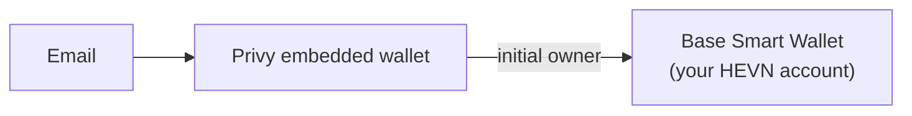

HEVN is a financial platform for global payments built on USDC. It gives individuals and businesses the tools a finance team expects — invoices, contacts, contracts, payouts to bank accounts, cards, and statements — without ever taking custody of their money.

Every HEVN account is a [Base Smart Wallet](https://docs.base.org/base-account/overview/what-is-base-account) on the Base network, owned exclusively by a key that only the user controls. HEVN the platform stores metadata (contacts, invoices, virtual account details) and orchestrates workflows, but it **cannot move, freeze, or access user funds**.

## Two ways to use HEVN, two people holding the key

Everything on this tab describes the **self-serve** product: the person who owns the email owns the
wallet, and nothing moves without a signature from their own key. HEVN cannot sign for them.

The [whitelabel](/whitelabel/overview) product moves that role. Your backend holds a developer key,
your customer's company is the account holder and legal owner of the funds, and every payment is
signed by you and co-signed by HEVN. Your customer never signs and never logs in.

Read this tab for how the platform is built and what it cannot do with the money. Read the
[Whitelabel](/whitelabel/overview) tab if you are the one holding the key.

<CardGroup cols={2}>
  <Card title="Architecture" icon="layers" href="/general/architecture">
    How email, Privy, and Base smart wallets fit together.
  </Card>
  <Card title="Key management with Privy" icon="key-round" href="/general/privy-wallets">
    Self-custodial keys secured by Shamir sharding and TEEs.
  </Card>
  <Card title="Base smart wallets" icon="wallet" href="/general/smart-wallets">
    Gasless USDC, deterministic addresses, and onchain ownership.
  </Card>
  <Card title="Security model" icon="shield-check" href="/general/security-model">
    What HEVN can and cannot do with your money.
  </Card>
  <Card title="Whitelabel" icon="boxes" href="/whitelabel/overview">
    Run HEVN under your own brand: create accounts for your customers from code and move their money with a key you hold.
  </Card>
</CardGroup>

## Core principles

### Non-custodial by construction

HEVN is not a wallet provider holding funds on your behalf. Your balance is USDC sitting in a smart contract wallet on Base. The only key that can authorize spending from that wallet is your [Privy embedded wallet](https://docs.privy.io/wallets/overview/embedded) — a key that is cryptographically sharded and never visible to HEVN or to Privy itself.

There is no HEVN omnibus account, no pooled balance, and no internal ledger that "represents" your money. The onchain balance **is** the balance.

### Deterministic identity

Your entire account chain is derived deterministically:

Because each step is deterministic, HEVN can compute the wallet address for any email address **before** the recipient ever signs up. This is what makes sending money by email safe: funds go directly to a smart wallet that only the owner of that email will ever be able to control. There is no escrow step and no custodial holding period.

### HEVN is never in the money flow

- **Deposits** (bank transfers, card top-ups, crypto) settle directly to your smart wallet address.
- **Payouts** to bank accounts are executed by a licensed banking partner: the partner issues a one-time deposit address, and *you* send the funds from your wallet. HEVN never receives, forwards, or holds the money.
- **Cross-chain deposits and withdrawals** use the [NEAR Intents 1Click API](https://docs.near-intents.org/integration/distribution-channels/1click-api/about-1click-api) with one-time passive deposit addresses that HEVN does not control.

## What the platform layer does

The HEVN API (and the JWT it issues) covers everything that is *not* money movement:

- Contact book, invoicing, and contract management
- Virtual account details (IBANs / account numbers) requested from partner banks and surfaced to you
- KYC/KYB, statements, analytics
- Team and multi-user access administration

Authorization to actually **spend** funds always happens at the wallet layer, with a signature from your key. See [Authentication](/general/authentication) for the split between platform auth and money auth.

## Interfaces

| Surface | What it is | Docs |
| --- | --- | --- |
| Web app | Full product UI at [app.gethevn.com](https://app.gethevn.com) | — |
| CLI | Scriptable access for operators and AI agents | [CLI tab](/cli/overview) |
| REST API | The whitelabel integration surface: create and operate accounts for your own customers | [REST API tab](/api-reference/overview) |
| Whitelabel | HEVN as the payments engine behind your product, under your brand | [Whitelabel tab](/whitelabel/overview) |
| MCP | Model Context Protocol server for AI agents | [Connect AI agents](/cli/connect-agents) |
