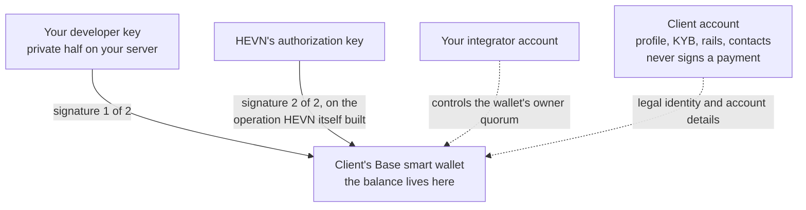

Your key can authorize a spend from every client wallet you created. Nobody else's can — and HEVN
cannot move that money without you either.

## Three accounts, one wallet each

Your **integrator account** is an ordinary HEVN account with one extra power: it creates and controls
other accounts. Each **client account** it creates is equally ordinary — a company identity, a KYB
subject, bank rails, contacts, a ledger — and a Base smart wallet of its own.

The wallet is the money. `baseSmartWallet` on the client record is where deposits settle, what
`GET /dapi/v1/client/balance` reads for the client in `X-Hevn-Account`, and what every payout
debits. Client wallets are separate
from each other and from yours: there is no pooled account and no omnibus balance anywhere in this
product.

## Who can spend

On chain the client's smart wallet has exactly one owner: an EOA created for that client, whose key
never exists outside [Privy's key management](/general/privy-wallets). Three things must happen
before that EOA signs anything:

1. **Your session is still allowed to ask.** Every request re-reads the developer key behind your
   token: it must still exist, the request must come from an address inside that key's immutable
   allowlist, and the route must be one the key's scopes open. HEVN checks all three again
   immediately before it co-signs.
2. **You sign.** Your developer key is a signer for the wallet, and signs the exact operation HEVN
   prepared.
3. **HEVN co-signs.** The signer is a two-of-two quorum: your key and HEVN's own authorization key.
   HEVN adds its half only to the operation it built itself, after verifying your signature over the
   same bytes locally.

The consequences are worth stating flatly:

| Question | Answer |
| --- | --- |
| Can you move a client's money without HEVN? | No. HEVN builds the operation and holds the second signature. |
| Can HEVN move a client's money without you? | No. HEVN cannot produce your signature, and one signature is not a quorum. |
| Can the client move its own balance? | Not through this API: nothing in it lets a client spend, and a client never signs a payment you make. Every movement starts with your signature. |
| Can HEVN freeze or seize a client balance? | No. HEVN can stop building new operations for a paused integrator; it cannot spend or claw back. |
| Does HEVN decide who a client may pay? | The partner bank does, through the refusals a payout can return. HEVN never picks a beneficiary. |

<Note>
  The [General](/general/what-is-hevn) tab describes a self-serve HEVN account, where the person who
  owns the email is the only signer. The whitelabel model moves that role to you: your customer's
  company is the account holder and legal owner of the funds, and your backend is the signer acting
  on its instructions. Everything else in
  [Trust assumptions](/general/trust-assumptions) still applies.
</Note>

## What this means for your product

Your customer sees your product, not HEVN — you are the party they hold responsible for every
movement. Two obligations follow.

**Every spend needs an authority in your own system.** HEVN authenticates your key, not your reason.
The approval, the four-eyes check and the audit trail behind "pay this invoice" are yours to build.
Keep the payment id you used as `Idempotency-Key`, the `debit` you asserted, and the
`transactionHash` you got back; together they are the record that ties your decision to the chain.

**The client's money survives your incident, not your negligence.** Because your integrator account —
not a single key — controls the wallet's owner quorum, losing a developer key is not losing funds:
create a new key, deploy it, delete the old one, and keep signing. A *leaked* key is different. Until
you delete it, whoever holds it can ask HEVN to build a payment from any of your clients' wallets it
has the scope for, and HEVN will co-sign it, because that is exactly what the key means. Two things
stand between the two: the key's IP allowlist, so the holder has to be on a network you listed, and
its scopes, which decide the routes it opens — but not the amounts they move. Deleting the key stops
the next request with it.

<Warning>
  Treat the developer key as a spending credential for every client balance at once. Keep the private
  half in a secret manager, never in a browser, never in a repository, keep its allowlist as narrow
  as your deployment allows, and rehearse
  [rotation](/whitelabel/developer-key#rotate-a-key) before you need it.
</Warning>

## Acting for a client, in one sentence

Reads and writes on a client's data and money are the same API calls you would make for yourself,
with `X-Hevn-Account: cl_…` added — one token, any client. Where that header is optional, where it is
required and where it is refused is [Sessions](/whitelabel/sessions#acting-as-a-client).

<Card title="Next: Developer key" icon="key-round" href="/whitelabel/developer-key">
  Create it, scope it, load it, and rotate it without downtime.
</Card>
