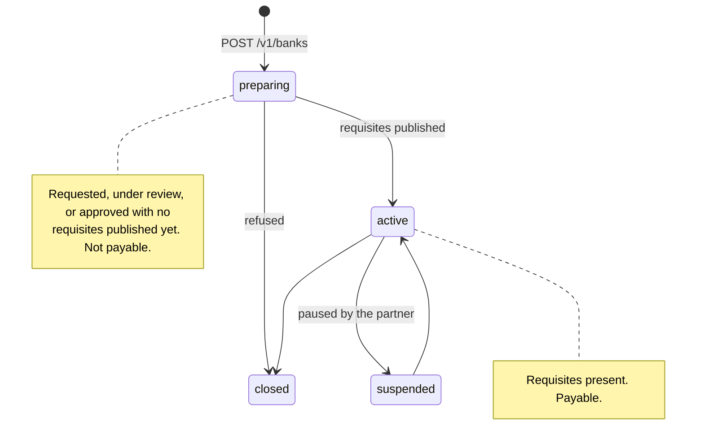

import ActingAsSnippet from "/snippets/acting-as.mdx";

A rail is a bank route you open for one client. Money wired to its requisites is converted and delivered to that client's wallet.

Opening one is two calls — ask what it needs, then ask for it. The rail id in both comes from `GET /v1/banks`, which you read first:

<CodeGroup>

```bash cURL
export HEVN_RAIL=$(curl -s "$HEVN_API/banks" \
  -H "Authorization: Bearer $HEVN_ACCESS_TOKEN" -H "X-Hevn-Account: $HEVN_CLIENT_ID" \
  | jq -r '.rails[] | select(.currency == "EUR" and .method == "sepa") | .rail' | head -1)
```

```python Python
northwind = hevn.acting_as(CLIENT_ID)
rail = next(r["rail"] for r in northwind.get("/banks")["rails"]
            if r["currency"] == "EUR" and r["method"] == "sepa")
```

```javascript Node
const northwind = hevn.actingAs(clientId);
const { rails } = await northwind.get("/banks");
const { rail } = rails.find((r) => r.currency === "EUR" && r.method === "sepa");
```

```go Go
northwind := api.ActingAs(clientID)
catalogue, err := northwind.Get("/banks")
rail := ""
for _, entry := range catalogue.List("rails") {
	if entry.Str("currency") == "EUR" && entry.Str("method") == "sepa" {
		rail = entry.Str("rail")
		break
	}
}
```

</CodeGroup>

<CodeGroup>

```bash cURL
curl "$HEVN_API/banks/$HEVN_RAIL/requirements" \
  -H "Authorization: Bearer $HEVN_ACCESS_TOKEN" \
  -H "X-Hevn-Account: $HEVN_CLIENT_ID"

curl -X POST "$HEVN_API/banks" \
  -H "Authorization: Bearer $HEVN_ACCESS_TOKEN" \
  -H "X-Hevn-Account: $HEVN_CLIENT_ID" \
  -H "Content-Type: application/json" \
  -d "{\"rail\":\"$HEVN_RAIL\"}"
```

```python Python
northwind = hevn.acting_as(CLIENT_ID)

needs = northwind.get(f"/banks/{rail}/requirements")
if needs["available"]:
    bank = northwind.post("/banks", {"rail": rail})
```

```javascript Node
const northwind = hevn.actingAs(clientId);

const needs = await northwind.get(`/banks/${rail}/requirements`);
const bank = needs.available ? await northwind.post("/banks", { rail }) : null;
```

```go Go
northwind := api.ActingAs(clientID)

needs, err := northwind.Get("/banks/" + rail + "/requirements")
if needs.Bool("available") {
	bank, err = northwind.Post("/banks", hevn.Body{"rail": rail})
}
```

</CodeGroup>

Examples use the client from [HTTP client](/whitelabel/reference/client). Every route on this page is client-scoped, so every call carries the account header:

<ActingAsSnippet />

## Four statuses



A rail is payable when `status` is `active`. That is the whole rule — `active` is only reported once the requisites exist, so there is no second condition to check and no client-side branch to write. A rail you have not opened has no `status` at all.

`suspended` is the partner pausing the account; money already in flight still settles, new payments do not start. `closed` is terminal.

<Note>
  In production a rail is opened by review, not by your call. `POST /v1/banks` answers `201` with `status: "preparing"` and the rail becomes `active` when the partner publishes the account details — hours to days, depending on the rail and the client's jurisdiction. In the sandbox that review is emulated and the rail activates at once.
</Note>

## Find the rail

Rail ids are opaque strings. You copy them out of `GET /v1/banks`, which returns the rails this client may be paid over and which of them are already open:

<CodeGroup>

```bash cURL
curl "$HEVN_API/banks" \
  -H "Authorization: Bearer $HEVN_ACCESS_TOKEN" \
  -H "X-Hevn-Account: $HEVN_CLIENT_ID"
```

```python Python
catalogue = northwind.get("/banks")
```

```javascript Node
const catalogue = await northwind.get("/banks");
```

```go Go
catalogue, err := northwind.Get("/banks")
```

</CodeGroup>

```json
{
  "rails": [
    {
      "rail": "sepa_named-bank_a",
      "currency": "EUR",
      "method": "sepa",
      "opened": false,
      "feeBps": 25,
      "supportedTokens": ["USDC"]
    },
    {
      "rail": "ach_named-bank_b",
      "currency": "USD",
      "method": "ach",
      "opened": true,
      "status": "active",
      "id": "bnk_88Hq3T",
      "feeBps": 25,
      "supportedTokens": ["USDC"],
      "settlementToken": "USDC",
      "minimumDeposit": "1.00",
      "requisites": { "…": "…" }
    }
  ]
}
```

The list is the client's own catalogue: rails closed to its residency are not in it. Pick by `currency` and `method`, never by parsing the id — what each method means and which currency it carries is in the [rail reference](/whitelabel/reference/rails). `GET /v1/banks/{rail}` returns one record in the same shape.

<Note>
  The rail ids printed on this page stand in for real ones. Ids differ per environment and per partner, and the only correct source is the `GET /v1/banks` you just ran for this client — which is why every call above takes `$HEVN_RAIL` rather than a literal.
</Note>

## What the requirements read tells you

`GET /v1/banks/{rail}/requirements` opens nothing, writes nothing and calls no partner. It answers with the gaps that would refuse an opening:

```json
{
  "rail": "sepa_named-bank_a",
  "currency": "EUR",
  "method": "sepa",
  "available": false,
  "blockers": [
    {
      "code": "phone_required",
      "field": "phone",
      "message": "The client needs a phone number before this rail can open."
    }
  ],
  "requires": { "phone": true, "address": false, "kyb": false },
  "kybStatus": "approved",
  "kycStatus": "notStarted"
}
```

`available` is `true` exactly when `blockers` is empty. There are three blockers, and each one has a single fix:

| `code` | Cleared by |
| --- | --- |
| `phone_required` | A phone number on the account — `POST /v1/clients` or `PATCH /v1/clients/{clientId}`. The phone inside the KYB document does not clear it. |
| `address_required` | A complete `company.address` in the [KYB document](/whitelabel/onboarding). Only some rails ask for it. |
| `kyb_required` | A KYB document that reads `ready: true`. Approval is not required to open the rail; it is required for the rail to go `active`. |

Which blockers a rail can report differs by rail, so read this route rather than assuming. `kycStatus` is the partner's own review state for this client on this rail — `notStarted`, `requested`, `incorporating`, `pending`, `underReview`, `documentRequested`, `approved` or `rejected`.

## Open it

```json
{ "rail": "sepa_named-bank_a" }
```

`201 Created`, `Location: /v1/banks/sepa_named-bank_a`, body is the rail record with `status: "preparing"`. A rail is a singleton per client, so opening one twice is safe: the second call answers `200` with `Idempotency-Replayed: true` and the same record, whether the first one is still preparing or already active. `Idempotency-Key` is accepted and unnecessary here.

Three refusals are worth branching on: `422 rail_requirements_unmet` carries `details.blockers` in the shape above, `404 rail_not_found` means the id is unknown or hidden, and `403 rail_not_available` means this client may not hold this rail. The rest are in the [error reference](/whitelabel/reference/errors).

Open rails one at a time — a client that needs EUR and USD is two calls.

## Read the requisites

Once the rail is `active`, its record carries the details a payer needs. They are in the client's own legal name — that is what "named" means in a rail id:

```json
{
  "rail": "sepa_named-bank_a",
  "currency": "EUR",
  "method": "sepa",
  "opened": true,
  "status": "active",
  "id": "bnk_88Hq3T",
  "settlementToken": "USDC",
  "minimumDeposit": "1.00",
  "requisites": {
    "fields": { "iban": "DE89370400440532013000", "bic": "BANKDEFFXXX" },
    "holder": { "type": "business", "businessName": "Northwind Trading Ltd" },
    "bankName": "Bank A",
    "state": "active"
  }
}
```

`fields` carries only the identifiers this method uses — an IBAN for SEPA, an account and routing number for ACH, and so on; the full matrix is in the [rail reference](/whitelabel/reference/rails).

`id` is the `bnk_…` a statement or a transaction filter refers to. Store it alongside the rail id.

Two numbers travel with the record. `minimumDeposit` is the smallest amount the partner will accept over this rail, in the rail's own currency; anything under it is returned by the bank, not by us. `feeBps` is HEVN's deposit fee in basis points — `25` is 0.25%, taken out of the converted amount.

### What the payer sees

On a `named` rail the account is in the client's own legal name, so the payer's bank shows the client and nothing about HEVN. Hand your end user the `fields`, the `holder` name and `bankName` exactly as they come back, and re-read them before each use rather than caching them — a partner can republish an account.

On a `pooled` rail the account belongs to the partner and `paymentReference` is what separates one client's money from another's, so a payment that arrives without it cannot be attributed. Pooled rails suit flows where your product generates the payment instruction; named rails suit flows where a human types it.

## Which stablecoin a deposit settles in

`supportedTokens` on the rail record is what this rail can deliver into the client's wallet, and `settlementToken` is what it delivers today. Neither is something you set after the fact: **the rail decides, and the rail is fixed when you open it.** A rail that can deliver two tokens ships as two rail ids, one per token, so choosing the token is choosing which rail to open with `POST /v1/banks` — see [Rails](/whitelabel/reference/rails).

Read both back, never cache them:

```json
{ "rail": "sepa_named-bank_a", "supportedTokens": ["EURC"], "settlementToken": "EURC" }
```

The choice that is yours per payment is on the money-in side. `POST /v1/payins` takes `settlementToken` and quotes the deposit in it; when no rail of the client's settles into the token you asked for, the refusal carries `details.options[]` with the pairs that do ([Payins](/whitelabel/payins)). Nothing on this page converts an existing balance — a settlement token only ever describes money that has not arrived yet.


<Card title="Next: Payins" icon="arrow-right" href="/whitelabel/payins">
  Quote an incoming payment, hand the payer instructions, and watch it settle.
</Card>
