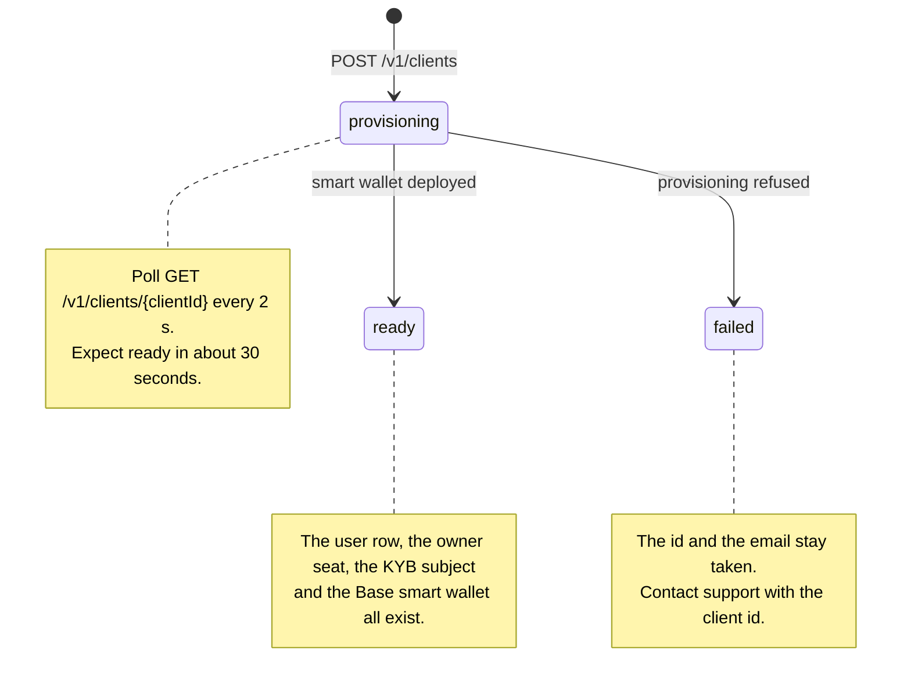

import PollSnippet from "/snippets/poll.mdx";

A client is a real HEVN account whose wallet your key controls. One call creates it; one id identifies it forever.

<CodeGroup>

```bash cURL
curl -X POST "$HEVN_API/clients" \
  -H "Authorization: Bearer $HEVN_ACCESS_TOKEN" \
  -H "Content-Type: application/json" \
  -d '{"name":"Northwind Trading Ltd","email":"ops@northwind.example","phone":"+13125550142"}'
```

```python Python
client = hevn.post("/clients", {
    "name": "Northwind Trading Ltd",
    "email": "ops@northwind.example",
    "phone": "+13125550142",
})
```

```javascript Node
const client = await hevn.post("/clients", {
  name: "Northwind Trading Ltd",
  email: "ops@northwind.example",
  phone: "+13125550142",
});
```

```go Go
client, err := api.Post("/clients", hevn.Body{
	"name":  "Northwind Trading Ltd",
	"email": "ops@northwind.example",
	"phone": "+13125550142",
})
```

</CodeGroup>

`201 Created`, `Location: /v1/clients/cl_7YQ2Kf3mN8`:

```json
{
  "id": "cl_7YQ2Kf3mN8",
  "status": "provisioning",
  "name": "Northwind Trading Ltd",
  "email": "ops@northwind.example",
  "phone": "+13125550142",
  "kybStatus": "notStarted",
  "createdAt": "2026-09-17T10:04:11Z",
  "pollUrl": "/v1/clients/cl_7YQ2Kf3mN8"
}
```

`baseSmartWallet` is absent because it does not exist yet. Responses omit fields with no value, so an absent field and a null field are the same thing — see [conventions](/whitelabel/conventions).

Examples use the client from [HTTP client](/whitelabel/reference/client). Nothing on this page acts as a client, so every call here carries your own access token and no account header.

## The three fields

<ParamField body="name" type="string" required>
  The company's legal name. It becomes the client's account name and the legal name of its KYB subject, so you write it once and never again. Uniqueness is global across HEVN — a generic name answers `409 name_in_use`.
</ParamField>

<ParamField body="email" type="string" required>
  The client's identity, lowercased server-side. HEVN sends no mail to this address: the account's own seat is an administrator seat, and administrators are not mail recipients. Treat it as an identifier and as your recovery key for a lost response.
</ParamField>

<ParamField body="phone" type="string">
  E.164, for example `+13125550142`. Optional here and required later: every rail a company opens checks for a phone number on the account. Passing it at creation is the difference between opening a rail in one call and opening it in two.
</ParamField>

## Three statuses



`ready` means usable. It is the only signal you need before you write the client's KYB document, open a rail for it or move its money.

## Wait until it is ready

Read the id you were given until its status changes. `pollUrl` on the create response is that path, so a poller never builds a URL.

<PollSnippet />

<CodeGroup>

```bash cURL
curl "$HEVN_API/clients/cl_7YQ2Kf3mN8" \
  -H "Authorization: Bearer $HEVN_ACCESS_TOKEN"
```

```python Python
client = poll_until(
    lambda: hevn.get(f"/clients/{client['id']}"),
    lambda c: c["status"] != "provisioning",
)
```

```javascript Node
const ready = await pollUntil(
  () => hevn.get(`/clients/${client.id}`),
  (c) => c.status !== "provisioning",
);
```

```go Go
ready, err := hevn.PollUntil(func() (hevn.Payload, error) {
	return api.Get("/clients/" + client.Str("id"))
}, func(c hevn.Payload) bool { return c.Str("status") != "provisioning" }, 2*time.Minute)
```

</CodeGroup>

A `ready` client carries the address that holds its money:

```json
{
  "id": "cl_7YQ2Kf3mN8",
  "status": "ready",
  "name": "Northwind Trading Ltd",
  "email": "ops@northwind.example",
  "phone": "+13125550142",
  "baseSmartWallet": "0x2f1c9a3b7e5d41c8a06f2d9b4e7c15839af0d6b2",
  "kybStatus": "notStarted",
  "createdAt": "2026-09-17T10:04:11Z"
}
```

There is one id to store. `cl_7YQ2Kf3mN8` is how you read this client, how you write its KYB document, and what you put in `X-Hevn-Account` to act for it on every money route. `baseSmartWallet` is the address that holds its balance; keep it for your own reconciliation, but no call takes it as an argument.

`Idempotency-Key` is accepted on the create and is not needed: an identical retry replays rather than creating a second company, and an open request for the same email is deduplicated whether you sent a key or not.

`kybStatus` follows the client's verification from here on — `notStarted`, then `pending`, `approved`, `rfi` or `rejected`. [Onboarding](/whitelabel/onboarding) owns that vocabulary; this row is where you read it without a second call.

## If provisioning fails

A `failed` client answers with a `failure` object and stays in your list:

```json
{
  "id": "cl_7YQ2Kf3mN8",
  "status": "failed",
  "failure": {
    "code": "provisioning_failed",
    "message": "Provisioning this client did not complete. Contact support with the client id.",
    "retriable": false
  }
}
```

The codes are `provisioning_failed`, `request_rejected` and `request_canceled`. The id and the email stay taken in all three cases, so re-sending the same body answers `409 email_in_use` rather than starting over. Contact support with the client id.

## Recover a lost response

The email is the recovery key. If a create call timed out and you never saw the id, ask for it back instead of creating a second company:

<CodeGroup>

```bash cURL
curl "$HEVN_API/clients?email=ops@northwind.example" \
  -H "Authorization: Bearer $HEVN_ACCESS_TOKEN"
```

```python Python
found = hevn.get("/clients", {"email": "ops@northwind.example"})["items"]
```

```javascript Node
const { items: found } = await hevn.get("/clients", { email: "ops@northwind.example" });
```

```go Go
page, err := api.Get("/clients", hevn.Query{"email": "ops@northwind.example"})
found := page.List("items")
```

</CodeGroup>

`GET /v1/clients` answers `{ "items": [...], "nextCursor": "..." }`, newest first, and includes clients that are still provisioning. It also takes `status` (`provisioning`, `ready`, `failed`) and cursor pagination. Re-sending an identical create body while the first request is still open replays it and answers `200` with `Idempotency-Replayed: true` and the same id; a different `name` or `phone` for the same open email answers `409 client_request_conflict`.

## Creating clients at scale

Two things bite when you onboard in bulk rather than one at a time.

The first is `name`. Uniqueness is global across HEVN, not per integrator, so a generic trading name will eventually answer `409 name_in_use` against a company that is not yours. Send the registered legal name, including its suffix — `Northwind Trading Ltd`, not `Northwind` — and treat the 409 as a signal to ask your customer for the exact name on their certificate, not as a reason to append a number.

The second is concurrency. Client creation is a queued operation; `ready` arrives in roughly 30 seconds under normal load and there is no ordering guarantee between two creates. Poll each client independently rather than waiting for a batch, and do not hold a request open waiting for the wallet.

## Update the phone and the address

`PATCH /v1/clients/{clientId}` writes two things and nothing else — the phone number the rails check, and the postal address:

<CodeGroup>

```bash cURL
curl -X PATCH "$HEVN_API/clients/cl_7YQ2Kf3mN8" \
  -H "Authorization: Bearer $HEVN_ACCESS_TOKEN" \
  -H "Content-Type: application/json" \
  -d '{"phone":"+13125550142"}'
```

```python Python
client = hevn.patch(f"/clients/{client_id}", {"phone": "+13125550142"})
```

```javascript Node
const patched = await hevn.patch(`/clients/${clientId}`, { phone: "+13125550142" });
```

```go Go
patched, err := api.Patch("/clients/"+clientID, hevn.Body{"phone": "+13125550142"})
```

</CodeGroup>

`address` takes `streetAddress`, `addressLine2`, `city`, `state` and `zip`. Only the keys you send are written.

Everything else a company has to tell HEVN is verification data and belongs in its KYB document. The address country is frozen at registration; changing a locked field answers `409 profile_locked` with `details.fields`.

## What your key can do with a client

Your developer key is the only key that can spend from this client's wallet. The client has no signer of its own and no login. That is the whole point of the whitelabel model, and it is the one thing to be deliberate about before you create your first client in production — see [accounts and custody](/whitelabel/accounts-and-custody).

<Card title="Next: Onboard a client" icon="arrow-right" href="/whitelabel/onboarding">
  Fill the KYB document, upload its papers, submit, and answer an RFI.
</Card>
