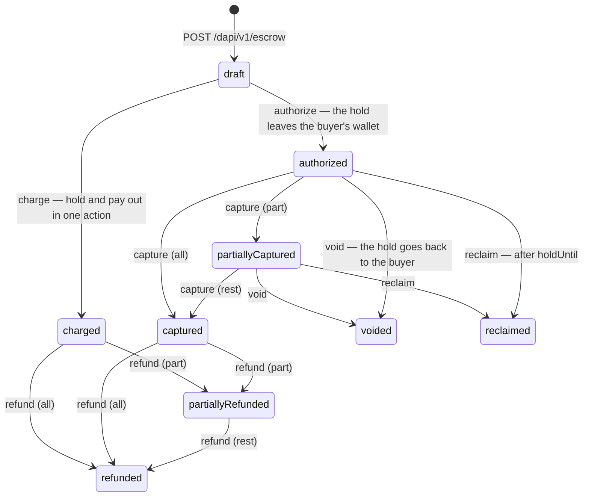
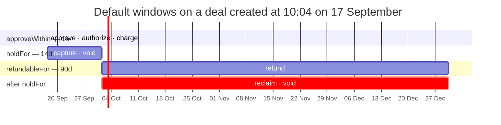

import IdempotencySnippet from "/snippets/idempotency.mdx";

Escrow locks one client's funds in an on-chain contract while another delivers. The buyer's funds stay in the buyer's own wallet until you authorize a lock, they then sit in the escrow contract where neither party — and neither HEVN nor you — can spend them outside its rules, and they reach the seller only when you capture.



A `voided` or `reclaimed` deal can still be refunded, if something was captured before the hold was released.

Every transition is one `POST /dapi/v1/escrow/{escrowId}/actions` that you sign with your developer key. You are the **operator** of every deal you create; escrow never takes `X-Hevn-Account`, because the caller is always you. It is one of two self-scoped families — the other is `POST /clients` and `GET /clients` — and both refuse the header the same way, with `400 account_scope_conflict` and `details.reason = "selfScopedRoute"`. See [Sessions](/whitelabel/sessions#acting-as-a-client).

## The states money is in

A deal carries two amounts, and they are what you branch on:

- **`capturableAmount`** — money out of the buyer's wallet, held in the contract, not yet paid to the seller. `capture` moves it to the seller, `void` returns it to the buyer, `reclaim` returns it after the hold window.
- **`refundableAmount`** — money already paid to the seller that you can still send back. A refund leaves **your own** wallet, not the seller's, so keep a working balance in the deal's token.

`status` is a label for the last thing that happened, not a decision input. Read **`availableActions`** — the server computes it from the amounts, the windows and what already landed on chain — and pick from it. A draft nobody approved in time has an empty `availableActions`; there is no `expired` status and nothing sweeps a stale deal.

Amounts are decimal strings in the token's major unit, rendered at the token's precision: `"100.000000"` for USDC. `token` is a symbol — `USDC` or `EURC` — never an address. The full status vocabulary is in [Escrow actions](/whitelabel/escrow-actions#statuses).

## The three parties

| Party | Who | What they do |
| --- | --- | --- |
| Sender | one of your clients, the buyer | Their wallet funds the deal. They sign nothing: your key signs on their wallet. |
| Receiver | another of your clients, the seller | Receives what you capture. |
| Operator | you, the integrator | Authorize, charge, capture, void, refund and reclaim. Every action, one key. |

All three must be different accounts, and both parties must be clients you created. HEVN binds sender and receiver through the sub-user relationship that `POST /clients` writes, so only accounts you provisioned through this API qualify; an account you merely referred never does, and a stranger's account id answers `422 receiver_not_a_client` or `404 client_not_found`. The addresses are each party's Base smart wallet at creation time, and the deal is immutable: its terms are hashed into an on-chain payment record.

## The three windows

You give three durations and HEVN resolves them once, at creation, each measured from the end of the one before it.



| Duration | Default | Ends at | What it bounds |
| --- | --- | --- | --- |
| `approveWithin` | `1h` | `windows.approveBy` | The buyer's approval, and the `authorize` or `charge` that collects the money. After it, an unapproved deal is dead. |
| `holdFor` | `14d` | `windows.holdUntil` | Your delivery window. `capture` is legal until it ends; after it the buyer can `reclaim`. |
| `refundableFor` | `90d` | `windows.refundableUntil` | Your returns window. `refund` is legal until it ends. |

A duration is `^\d{1,4}[smhd]$` — `30m`, `1h`, `14d`. You never compute a timestamp, which is what makes a retry safe: repeating `POST /dapi/v1/escrow` with the same `Idempotency-Key` returns the same deal with the same absolute windows, no matter how much later it arrives. Different durations under the same key answer `409 idempotency_key_reused` with `details.escrowId`.

`void` is the exception with no clock on it: while anything is capturable, you can always hand it back.

## What it costs

`feeBps` on the deal is your **ceiling**, an integer in basis points. `capture` and `charge` may take any fee up to it; the fee goes to your own Base smart wallet, which HEVN derives — there is no `feeReceiver` to send. `fee = amount × feeBps / 10000`, the receiver gets the rest, and a refund returns the gross amount from your wallet without clawing the fee back.

Set the ceiling at creation. It is part of the immutable deal, so a deal created with `feeBps: 0` can never take a commission.

HEVN sponsors the gas for every action and charges nothing on top.

## Before you start

- Both parties are clients of yours and are `ready` — see [Clients](/whitelabel/clients).
- Your account may operate escrow. HEVN enables that, in the sandbox as in production; nothing in the API grants it. Without it every escrow call is refused — see [Going live](/whitelabel/going-live#what-hevn-must-enable).
- The buyer's wallet holds the token when you authorize, not when you create. Creating a deal moves nothing.
- Call escrow with your own access token and **no** `X-Hevn-Account` — the header answers `400 account_scope_conflict` on every escrow route.
- Your developer key registration is active and the call leaves an allowlisted source IP. Both are re-checked on every request, and again immediately before HEVN co-signs an action — see [Developer key](/whitelabel/developer-key).

<IdempotencySnippet />

## A marketplace order, end to end

Every example below uses the client from [HTTP client](/whitelabel/reference/client) and the `sign_payload` helper from [Signing](/whitelabel/signing).

Order `A-1187`: Northwind Trading Ltd (`cl_7YQ2Kf3mN8`) buys 100 USDC of parts from Ardenne Fabrication SARL (`cl_2ABxR9dL4m`), and you take 2.5% when it ships.

<Steps>
  <Step title="Open the deal and approve the spend permission">
    One call creates the deal and prepares the buyer's approval — the on-chain permission that lets you pull the money later. Confirm it with the **same** key the create carried; the response echoes it as `action.idempotencyKey`.

    <CodeGroup>
    ```python Python
    deal = hevn.post("/escrow", {
        "senderClientId": "cl_7YQ2Kf3mN8",
        "receiverClientId": "cl_2ABxR9dL4m",
        "token": "USDC",
        "maxAmount": "100.00",
        "approveWithin": "1h", "holdFor": "14d", "refundableFor": "90d",
        "feeBps": 250,
        "reference": {"orderId": "A-1187"},
    }, idempotency_key="order-A-1187")

    approve = deal["action"]
    signature = key.sign_payload(approve["approval"]["payload"])
    hevn.post(f"/escrow/{deal['id']}/actions/{approve['idempotencyKey']}/confirm",
              {"signature": signature})
    ```

    ```javascript Node
    const deal = await hevn.post("/escrow", {
      senderClientId: "cl_7YQ2Kf3mN8",
      receiverClientId: "cl_2ABxR9dL4m",
      token: "USDC",
      maxAmount: "100.00",
      approveWithin: "1h", holdFor: "14d", refundableFor: "90d",
      feeBps: 250,
      reference: { orderId: "A-1187" },
    }, { idempotencyKey: "order-A-1187" });

    const approve = deal.action;
    const signature = key.signPayload(approve.approval.payload);
    await hevn.post(`/escrow/${deal.id}/actions/${approve.idempotencyKey}/confirm`, { signature });
    ```

    ```go Go
    deal, err := api.Post("/escrow", hevn.Body{
    	"senderClientId":   "cl_7YQ2Kf3mN8",
    	"receiverClientId": "cl_2ABxR9dL4m",
    	"token":            "USDC",
    	"maxAmount":        "100.00",
    	"approveWithin":    "1h", "holdFor": "14d", "refundableFor": "90d",
    	"feeBps":    250,
    	"reference": hevn.Body{"orderId": "A-1187"},
    }, hevn.IdempotencyKey("order-A-1187"))

    signature, err := key.SignPayload(deal.Str("action.approval.payload"))
    _, err = api.Post("/escrow/"+deal.Str("id")+"/actions/"+
    	deal.Str("action.idempotencyKey")+"/confirm", hevn.Body{"signature": signature})
    ```
    </CodeGroup>

    ```json Response — 201, Location: /dapi/v1/escrow/esc_5Qb4e17c9d
    {
      "id": "esc_5Qb4e17c9d",
      "status": "draft",
      "availableActions": ["approve"],
      "sender": { "clientId": "cl_7YQ2Kf3mN8" }, "receiver": { "clientId": "cl_2ABxR9dL4m" },
      "token": "USDC", "maxAmount": "100.000000",
      "authorizedAmount": "0.000000",
      "capturableAmount": "0.000000", "refundableAmount": "0.000000",
      "windows": { "approveBy": "2026-09-17T11:04:11Z",
                   "holdUntil": "2026-10-01T11:04:11Z",
                   "refundableUntil": "2026-12-30T11:04:11Z" },
      "action": { "action": "approve", "idempotencyKey": "order-A-1187",
                  "status": "awaitingSignature",
                  "approval": { "id": "a7c1…", "payload": "eyJ…",
                                "expiresAt": "2026-09-17T10:05:11Z" } },
      "createdAt": "2026-09-17T10:04:11Z"
    }
    ```

    Nothing has moved. `availableActions` becomes `["authorize", "charge"]` once the approval lands on chain — if the confirm answers `202`, poll it to settlement first ([Escrow actions](/whitelabel/escrow-actions#confirming-an-action)).
  </Step>

  <Step title="Lock the buyer's funds in the contract">
    `authorize` pulls the amount out of the buyer's wallet into the escrow contract. It happens **once** per deal: authorize less than `maxAmount` and the remainder is unusable, so authorize the order total.

    <CodeGroup>
    ```python Python
    action = hevn.post(f"/escrow/{deal['id']}/actions",
                       {"action": "authorize", "amount": "100.00"},
                       idempotency_key="order-A-1187-authorize")
    hevn.post(f"/escrow/{deal['id']}/actions/order-A-1187-authorize/confirm",
              {"signature": key.sign_payload(action["action"]["approval"]["payload"])})
    ```

    ```javascript Node
    const action = await hevn.post(`/escrow/${deal.id}/actions`,
      { action: "authorize", amount: "100.00" },
      { idempotencyKey: "order-A-1187-authorize" });

    await hevn.post(`/escrow/${deal.id}/actions/order-A-1187-authorize/confirm`,
      { signature: key.signPayload(action.action.approval.payload) });
    ```

    ```go Go
    action, err := api.Post("/escrow/"+deal.Str("id")+"/actions",
    	hevn.Body{"action": "authorize", "amount": "100.00"},
    	hevn.IdempotencyKey("order-A-1187-authorize"))

    signature, err := key.SignPayload(action.Str("action.approval.payload"))
    _, err = api.Post("/escrow/"+deal.Str("id")+"/actions/order-A-1187-authorize/confirm",
    	hevn.Body{"signature": signature})
    ```
    </CodeGroup>

    ```json Response — 200
    { "deal": { "id": "esc_5Qb4e17c9d", "status": "authorized",
                "capturableAmount": "100.000000", "refundableAmount": "0.000000",
                "availableActions": ["capture", "void"] },
      "action": { "action": "authorize", "idempotencyKey": "order-A-1187-authorize",
                  "status": "confirmed", "amount": "100.000000",
                  "transactionHash": "0x3a77…" },
      "events": [ { "name": "PaymentAuthorized", "amount": "100.000000",
                    "transactionHash": "0x3a77…", "blockNumber": 19884412 } ] }
    ```

    The buyer's balance is down 100 USDC, the seller has nothing yet, and you have 14 days to deliver.
  </Step>

  <Step title="Ship it, and capture with your commission">
    `capture` pays the seller and takes your fee in the same action. It is repeatable up to `capturableAmount`, so a partial shipment is a partial capture.

    <CodeGroup>
    ```python Python
    capture = hevn.post(f"/escrow/{deal['id']}/actions",
                        {"action": "capture", "amount": "100.00", "feeBps": 250},
                        idempotency_key="order-A-1187-capture")
    hevn.post(f"/escrow/{deal['id']}/actions/order-A-1187-capture/confirm",
              {"signature": key.sign_payload(capture["action"]["approval"]["payload"])})
    ```

    ```javascript Node
    const capture = await hevn.post(`/escrow/${deal.id}/actions`,
      { action: "capture", amount: "100.00", feeBps: 250 },
      { idempotencyKey: "order-A-1187-capture" });

    await hevn.post(`/escrow/${deal.id}/actions/order-A-1187-capture/confirm`,
      { signature: key.signPayload(capture.action.approval.payload) });
    ```

    ```go Go
    capture, err := api.Post("/escrow/"+deal.Str("id")+"/actions",
    	hevn.Body{"action": "capture", "amount": "100.00", "feeBps": 250},
    	hevn.IdempotencyKey("order-A-1187-capture"))

    signature, err := key.SignPayload(capture.Str("action.approval.payload"))
    _, err = api.Post("/escrow/"+deal.Str("id")+"/actions/order-A-1187-capture/confirm",
    	hevn.Body{"signature": signature})
    ```
    </CodeGroup>

    The seller receives 97.50 USDC, 2.50 lands on your wallet, and the deal ends `captured` with `refundableAmount: "100.000000"` — the gross is what you can still send back.
  </Step>
</Steps>

## When the order does not go to plan

| What happened | Action | Where the money goes |
| --- | --- | --- |
| Cancelled before you ship | `void` | The whole hold returns to the buyer. The deal ends `voided` and nothing was charged. |
| Only part shipped | `capture` the shipped lines, then `void` the rest | The deal passes `partiallyCaptured` and ends `voided`, with the captured amount still refundable. |
| Returned after delivery | `refund` | The amount leaves **your** wallet and reaches the buyer. `partiallyRefunded`, then `refunded`. |
| You never captured | `reclaim`, after `holdUntil` | The hold returns to the buyer. You can run it for them; it keeps working even if your integrator profile is paused. |

`void`, `refund` and `reclaim` keep working when your relationship with a client is paused or your profile is suspended, so held money is never stranded.

<Warning>
  A refund is paid by your own wallet, not out of the deal. If you owe refunds, keep a balance in the deal's token — an empty operator wallet turns `refund` into `409 simulation_failed`.
</Warning>

<Card title="Next: Escrow actions" icon="list-check" href="/whitelabel/escrow-actions">
  Every action, the window it is legal in, the amount it takes, and the state it leaves behind.
</Card>
