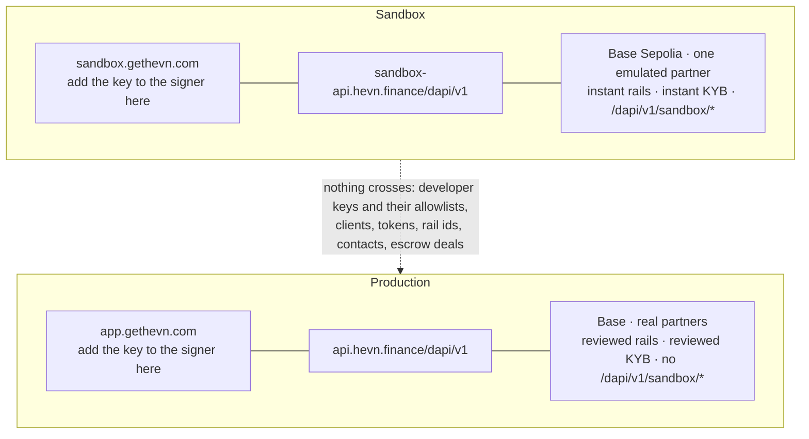

import EnvSnippet from "/snippets/env.mdx";

Production differs in four ways: what HEVN must enable for you, what you re-create per environment, what stops being instant, and what starts being refused. The routes, bodies and error slugs are identical.

<EnvSnippet />

## What HEVN must enable

Four things are granted by HEVN rather than by the API — in the sandbox exactly as in production — and each one has a refusal that tells you it is missing.

| What | Without it | Ask for it when |
| --- | --- | --- |
| An active integrator profile | `403 integrator_inactive` on `POST /dapi/v1/clients`, and `403 account_forbidden` on every call that acts for a client you already have | Before you write production code. It follows a partnership review, off-platform. |
| Client creation | `403 client_creation_not_enabled` on `POST /dapi/v1/clients` | Same conversation. It is granted separately from the profile. |
| Escrow operation | Escrow actions are refused | Only if funds must be locked on chain between your own customers. |
| The rails you need | `403 rail_not_available` on `POST /dapi/v1/banks` | Name the currencies and countries you sell into. Rail availability is per integrator, per client and per partner. |

Confirm all four the same way you would in the sandbox: create one client, read `GET /dapi/v1/banks` for it, and check that the rails you expect are listed.

## Nothing carries over

| Re-create in production | Why |
| --- | --- |
| The developer key | Keys belong to one environment. Create a fresh one in the production app, with the **production** egress IPs in its allowlist and the scopes that deployment needs. The sandbox key, and the sandbox allowlist, are both unknown in production. |
| Every client | A `cl_…` from the sandbox does not exist in production, and neither does anything hanging off it: KYB, rails, contacts, escrow deals. |
| Tokens | Access and refresh tokens are environment-scoped. |
| Rail ids | Rail ids are opaque strings you copy from `GET /dapi/v1/banks`. Never hardcode one you saw in the sandbox; read them per client, per environment. |
| Idempotency keys | Keys are scoped to your account and the environment. A key that replayed a sandbox payout means nothing in production. |

Keep both sets of credentials loadable at once and choose by `HEVN_API`: a deploy that points a production key at the sandbox host fails at login with `401 invalid_credentials`, and nothing in that refusal says you swapped a variable.

The allowlist is the second variable that fails this way. A key is pinned to the source IPs you gave it and cannot be edited, so a production deploy behind a different NAT answers `403` on every call although the key, the signature and the token are all correct. Enumerate the egress addresses of every host that will call HEVN — including the ones an autoscaler adds — before you create the production key.

The scopes are the third. They are fixed at creation too, and a route the key does not cover answers `403 forbidden` with `details.requiredScope`. A production key that confirms payouts and maintains the contact book needs `payout:sign` and `recipient:write`; one that also runs escrow needs `escrow:sign`. See [Developer key](/whitelabel/developer-key#scopes).

## What stops being instant

In the sandbox every row exists by the time the call returns. In production most of these are queues with humans or banks behind them.

| Step | Sandbox | Production |
| --- | --- | --- |
| Client provisioning | seconds | seconds — poll `GET /dapi/v1/client` with `X-Hevn-Account` until `ready` |
| KYB decision | approved on completion | a review. Poll `GET /dapi/v1/client/kyb` with `X-Hevn-Account`; expect `rfi` at least as often as `approved` |
| Rail activation | `active` with account details immediately | `preparing` until the partner publishes the account details. Poll `GET /dapi/v1/banks` |
| Payin settlement | you call `/dapi/v1/sandbox/payins/{payinId}/complete` | the payer's bank moves on its own clock; the income row appears when it lands |
| Payout settlement | you call `/dapi/v1/sandbox/payouts/{payoutId}/status` | the partner drives it. `settled` means accepted and debited, not delivered |
| Ledger rows | written before the call returns | written when the money moves. Reconcile from `GET /dapi/v1/transactions`, not from the response you got an hour ago |

Every one of those is the same fix: a poller with backoff and a deadline, keyed on your own record. Both of the shapes you need are on the pages that produce them — `poll_until` in the guides and the full loop in [HTTP client](/whitelabel/reference/client).

## What production starts refusing

Refusals your sandbox runs never produced, because the emulator never argues:

- **`422 contact_payment_details_invalid`** — the receiving bank does not recognise the beneficiary. Usually the name. Correct the contact with `PATCH /dapi/v1/contacts/{contactId}` and book again.
- **`422 rail_requirements_unmet` and `422 phone_required`** — a rail wants something the client has not given yet. `GET /dapi/v1/banks/{rail}/requirements` lists it.
- **`422 amount_below_minimum` and `422 amount_above_maximum`** — real rail minimums replace the sandbox's `0.10`.
- **`attention: {"kind": "rfi"}` on a payout** — the partner is holding the transfer pending a question. Nothing you sign moves it until the question is answered.
- **`503 provider_unavailable`** — a partner is down. Retry with backoff; do not re-book.
- **`429 rate_limited`** — the counters are enforced in production. Honour `Retry-After`. See [Limits](/whitelabel/reference/limits#rate-limits).

## The checklist

<Steps>
  <Step title="Point at the production host">
    Set `HEVN_API` to `https://api.hevn.finance/dapi/v1`. Nothing else in your code changes.
  </Step>
  <Step title="Get the flags">
    Integrator profile, client creation, escrow if you need it, and the rails for your markets. Verify by listing rails for a real client, not by being told.
  </Step>
  <Step title="Create a production developer key">
    In the production app, with the production egress IPs in its allowlist and the scopes that deployment needs. Save the private half the browser shows you to a file with mode `0600` on the machine that will hold it. Never copy the sandbox key, and never assume the sandbox allowlist or scopes carry over.
  </Step>
  <Step title="Delete every /dapi/v1/sandbox call">
    There are four, and all four answer `404` in production. Whatever they drove — a deposit, a payin settling, a payout moving — now happens because a bank did it.
  </Step>
  <Step title="Replace instant reads with polling">
    Client `ready`, KYB decided, rail `active`, payin credited, payout settled. Back off, cap the interval, set a deadline, and record the state on your side before you act on it.
  </Step>
  <Step title="Handle 429 and log X-Request-ID">
    One HTTP helper that sleeps for `Retry-After`, re-mints once on `401`, and logs `X-Request-ID` on anything `5xx`. Support asks for that id first.
  </Step>
  <Step title="Re-read your refusal handling">
    Especially the four funding codes: `already_funded` is success, `funding_in_progress` means wait, `funding_attempt_expired` means re-open with the same key, and `payment_slot_consumed` means this payout can never move money — book a new one. See [Errors](/whitelabel/reference/errors#funding-a-payment).
  </Step>
  <Step title="Rehearse losing the key">
    Create a second key before you need it, book a payout naming the new `publicKey`, and confirm it. Rotation is a field on `POST /dapi/v1/payouts`, not a migration — but only if the second key already exists **and** its allowlist and scopes cover the hosts and routes that will use it. Delete the old key once the new one has carried a payment.
  </Step>
  <Step title="Fund what production makes you fund">
    Escrow refunds leave your own wallet, and a payout debits the client's. The sandbox faucet account covered both; now your balances do.
  </Step>
</Steps>

<Warning>
  Run one real payment end to end before you point customers at it: one client, one rail, one small payout to an account you control, reconciled from `GET /dapi/v1/transactions`. Every difference on this page shows up in that one run.
</Warning>

<Card title="Next: Coverage" icon="globe" href="/whitelabel/reference/coverage">
  The currencies money can arrive in, the markets it can leave for, and what decides availability.
</Card>
