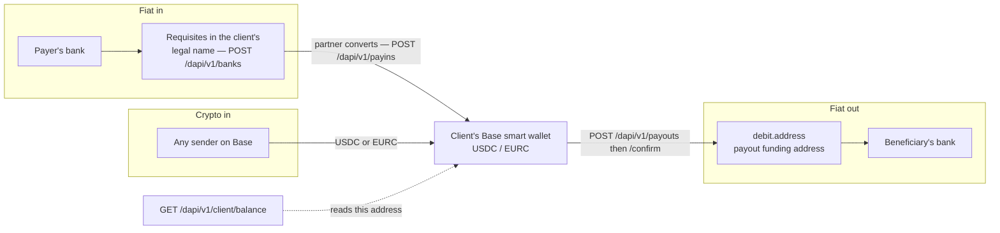

Every client balance is a stablecoin on one address. Everything else is a partner moving fiat to or
from it.

## A balance is a stablecoin on one address

`POST /dapi/v1/clients` deploys a Base smart wallet for the client and returns its address as
`baseSmartWallet`. That address is the balance: `GET /dapi/v1/client/balance`, with the client's id
in `X-Hevn-Account`, reads it on chain, one row per settlement token, and no HEVN database holds an
authoritative copy.

Two tokens can sit there: **USDC** and **EURC**. Which one a rail settles into is the rail's
`settlementToken`, fixed when the rail is opened and reported next to its `supportedTokens`; per
deposit, `POST /dapi/v1/payins` takes the `settlementToken` you want that arrival delivered in.

## Fiat in is a conversion you priced

A rail is a bank route you request for one client. When the partner bank opens it, it publishes
**requisites** — an IBAN, an account and routing number, a PIX key — in the client's own legal
name. Money wired there is
received by the partner bank, converted at the rate the rail quotes, and delivered to the client's
wallet as the rail's settlement token, minus the rail's `feeBps`.

You can price that arrival before it happens. `POST /dapi/v1/payins` quotes an incoming amount and
`POST /dapi/v1/payins/{payinId}/instructions` returns what the payer needs to see. Money that arrives
without a quote — an unsolicited wire to open requisites — still lands and still becomes an income
row; the quote exists so you can show your customer a number first.

Crypto in has two shapes. Anything sent to `baseSmartWallet` on Base is the client's balance the
moment it confirms — no rail, no quote, nothing to call. Or quote it first: `POST /dapi/v1/payins`
takes `originChainId` **instead of** `rail` — exactly one of the two — to price an incoming on-chain
transfer, and `POST /dapi/v1/payins/{payinId}/instructions` answers with the `address` to send to,
its `chainId`, and the `memo` that chain requires. `PayinView` then reports both
`originChainId` and `destinationChainId`.

## Fiat out is funded from the wallet

`POST /dapi/v1/payouts` does the whole opening move: it prices the payment, books it with the
partner, and builds the on-chain operation that funds it. The response carries three things you act
on — the `quote` (what the beneficiary gets and what it costs), the `approval` (the bytes to sign)
and the `debit` (exactly what leaves the client's wallet: an amount of USDC to the funding address
for this payout — a single-purpose address that the partner's fiat leg consumes, not a balance HEVN
keeps). `POST /dapi/v1/payouts/{payoutId}/confirm` with your signature executes that debit, and the
partner pays the beneficiary's bank.

The side you typed is inviolable. Send `amount` to pin what leaves the balance, or `amountTo` to pin
what the beneficiary receives — never both, and never re-derive the other side yourself.

A wallet contact is the same envelope with no fiat leg. `POST /dapi/v1/payouts` with a contact that
is an address, then the same confirm route, sends USDC from the client's wallet straight to it — no
conversion, no partner, no second resource to learn.

## Progress is read, not pushed

Only the chain leg is fast, and even it is not synchronous: a confirm answers `200` with a
`transactionHash` when the receipt lands inside the request, and `202 submitted` when it does not —
in which case you confirm again, which is always safe. Every fiat leg is slower than that by a
partner's business hours, so the state you act on comes from a read:
`GET /dapi/v1/payouts/{payoutId}`, `GET /dapi/v1/payins/{payinId}`, `GET /dapi/v1/banks`,
`GET /dapi/v1/client/balance`.

## One ledger per client

Both directions end in the same place: a transaction row on the client.
`GET /dapi/v1/transactions` with `X-Hevn-Account: cl_…` walks it newest first,
`GET /dapi/v1/transactions/summary` totals the same filters, and `GET /dapi/v1/transactions/export`
renders a statement. That ledger, not your own bookkeeping, is what a client's customer support answers from.

<Note>
  Every amount on the wire is a decimal string in the asset's major unit — `"500.00"`, never `500`
  and never `"500000000"`. See [Conventions](/whitelabel/conventions#money).
</Note>

<Card title="Next: Quickstart" icon="rocket" href="/whitelabel/quickstart">
  Do all of this once, in the sandbox, in about twenty minutes.
</Card>
