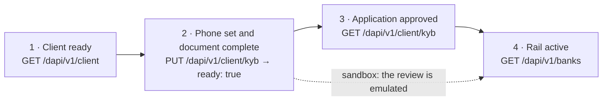
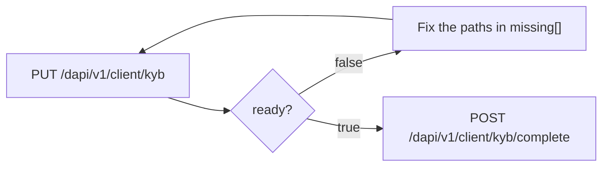

import ActingAsSnippet from "/snippets/acting-as.mdx";

A client can receive money once it has passed four gates. Three of them are one API call each.



Gate 1 is [creating the client](/whitelabel/clients). Gate 4 is [opening a rail](/whitelabel/bank-accounts). This page is gates 2 and 3: one document, one readiness list, one submission.

No route here names the client in its path. `PUT /dapi/v1/client/kyb`, `GET /dapi/v1/client/kyb` and `POST /dapi/v1/client/kyb/complete` all **require** `X-Hevn-Account`, and document upload accepts the same header. Your own access token is the only credential any of this needs. Examples use the client from [HTTP client](/whitelabel/reference/client).

<ActingAsSnippet />

## One document, written until it is complete

The client's verification data is a single JSON document. You `PUT` the whole thing, HEVN answers with what is still missing, you fix those paths and `PUT` again. There is no form to build, no order to respect and no second readiness rule: the `missing[]` list is produced by the same gate that decides whether submission succeeds.



The write is idempotent by construction. Every person carries a `key` you choose, HEVN derives that person's id from it, and the same body written twice touches the same records instead of creating a second Jane Doe. `Idempotency-Key` is accepted and unnecessary here — a `PUT` is already safe to repeat.

### What the document describes

Three things, and a reviewer reads all three together:

- **The company** — who it is on paper, where it is registered, what it sells, and where its money comes from and goes.
- **Its people** — the humans who own it, control it, direct it or sign for it. A reviewer needs a name, a date of birth, an address, a phone number and a tax residence for each one.
- **Its papers** — files, each filed into a named slot, proving the two above.

You send all three in one body, or any subset of them. Writing `company` alone leaves the people and the documents exactly as they were, so the writes below can be three separate calls or one.

<Steps>

<Step title="Write the company">

Send what you know. Required values, their accepted enum members and the exact spelling of each field live in the [KYB field reference](/whitelabel/reference/kyb-fields). The example below is the required core; the document also takes some forty optional fields a reviewer often asks for later — `identityDocuments`, `operatingCountries`, `highRiskActivities`, `hasPep`, `isRegulated` and the per-method volume split among them. Filling the ones you already hold turns most RFIs into no RFI at all.

```json
{
  "company": {
    "legalName": "Northwind Trading Ltd",
    "country": "US",
    "taxId": "88-1234567",
    "phone": "+13125550142",
    "email": "compliance@northwind.example",
    "address": {
      "streetAddress": "401 N Michigan Ave",
      "city": "Chicago",
      "state": "US-IL",
      "zip": "60601",
      "country": "US"
    },
    "entityType": "llc",
    "expectedMonthlyVolumeUsd": "250000",
    "businessDescription": "Wholesale and retail distribution of industrial fasteners.",
    "businessType": "retail",
    "sourceOfFunds": "business_revenue",
    "purposeOfFunds": "vendor_payments",
    "flowOfFunds": "Customers pay us by wire; we pay suppliers in EUR."
  }
}
```

<CodeGroup>

```bash cURL
curl -X PUT "$HEVN_API/client/kyb" \
  -H "Authorization: Bearer $HEVN_ACCESS_TOKEN" \
  -H "X-Hevn-Account: $HEVN_CLIENT_ID" \
  -H "Content-Type: application/json" \
  --data @document.json
```

```python Python
readiness = northwind.put("/client/kyb", document)
```

```javascript Node
const readiness = await northwind.put("/client/kyb", document);
```

```go Go
readiness, err := northwind.Put("/client/kyb", document)
```

</CodeGroup>

`200 OK`:

```json
{
  "ready": false,
  "missing": [
    "people",
    "documents.certificate_of_incorporation",
    "documents.corporate_structure",
    "documents.director_structure",
    "documents.proof_of_address",
    "documents.source_of_funds",
    "documents.tax_identification_document"
  ],
  "people": []
}
```

`ready: false` is not an error. The write succeeded; the document is incomplete.

</Step>

<Step title="Add the people">

`people[]` is the client's owners, directors and signers. Give each one a `key` — any stable string of your own, 1 to 64 characters from `A-Z a-z 0-9 . _ : -`. Re-sending the same key updates the same person.

```json
{
  "people": [
    {
      "key": "jane",
      "firstName": "Jane",
      "lastName": "Doe",
      "dateOfBirth": "1984-02-11",
      "email": "jane@northwind.example",
      "phone": "+13125550188",
      "address": {
        "streetAddress": "1120 W Fulton Market",
        "city": "Chicago",
        "state": "US-IL",
        "zip": "60607",
        "country": "US"
      },
      "taxIdCountry": "US",
      "taxId": "123-45-6789",
      "ownershipPercentage": "100",
      "hasControl": true,
      "isDirector": true,
      "isSigner": true
    }
  ]
}
```

The response echoes the key-to-id map, so you can store either:

```json
{
  "ready": false,
  "missing": [
    "documents.certificate_of_incorporation",
    "people[0].documents.proof_of_address"
  ],
  "people": [{ "key": "jane", "id": "7f1e6b2c-90a4-4d31-9b5e-2c08d7a41f63" }]
}
```

Sending `people` replaces the roster: a person you created and then omit is removed. Omitting the `people` key entirely leaves the roster alone, and `"people": []` empties it. A person somebody added outside the flat document is never deleted — a `PUT` that would drop one answers `409 kyb_roster_conflict` with `details.entityIds`.

</Step>

<Step title="Upload the papers">

Upload a file once, then file its id into a slot. `POST /dapi/v1/documents` takes JSON, with the file base64-encoded in `content` and the slot in `slot`. Uploads act on a client, so send `X-Hevn-Account` here too.

<CodeGroup>

```bash cURL
curl -X POST "$HEVN_API/documents" \
  -H "Authorization: Bearer $HEVN_ACCESS_TOKEN" \
  -H "X-Hevn-Account: $HEVN_CLIENT_ID" \
  -H "Content-Type: application/json" \
  -d "{\"slot\":\"certificate_of_incorporation\",\"fileName\":\"incorporation.pdf\",
       \"content\":\"$(base64 < incorporation.pdf | tr -d '\n')\"}"
```

```python Python
import base64, pathlib

upload = northwind.post("/documents", {
    "slot": "certificate_of_incorporation",
    "fileName": "incorporation.pdf",
    "content": base64.b64encode(pathlib.Path("incorporation.pdf").read_bytes()).decode(),
})
```

```javascript Node
const upload = await northwind.post("/documents", {
  slot: "certificate_of_incorporation",
  fileName: "incorporation.pdf",
  content: readFileSync("incorporation.pdf").toString("base64"),
});
```

```go Go
file, err := os.ReadFile("incorporation.pdf")
upload, err := northwind.Post("/documents", hevn.Body{
	"slot":     "certificate_of_incorporation",
	"fileName": "incorporation.pdf",
	"content":  base64.StdEncoding.EncodeToString(file),
})
```

</CodeGroup>

`201 Created` answers `{ "id": "doc_1a7Kd2", "slot": "certificate_of_incorporation", "fileName": "incorporation.pdf" }`. The same bytes in the same slot answer the first id with `200` rather than storing a second copy, so a retried upload never forks a document. A decoded file over 20 MB answers `413 payload_too_large`, and content that is not base64 answers `422 validation_failed` naming `content`.

File the id into a slot on the next write — company papers under the document's own `documents[]`, personal papers under the person's:

```json
{
  "documents": [{ "slot": "certificate_of_incorporation", "uploadId": "doc_1a7Kd2" }],
  "people": [
    { "key": "jane", "documents": [{ "slot": "proof_of_address", "uploadId": "doc_5b3Qm9" }] }
  ]
}
```

Re-filing the same upload in the same slot is a no-op. A different upload in an occupied slot replaces what was there. An unknown slot answers `422 document_type_unsupported` with the accepted list in `details.allowed` and the path in `details.field`, refused before anything is written. An upload id that is not this client's answers `404 document_not_found` with `details.uploadId`.

</Step>

<Step title="Read the document back">

`GET /dapi/v1/client/kyb` returns readiness, the application if one is filed, and the whole document projected back, so you can diff your own state against HEVN's:

```json
{
  "ready": true,
  "missing": [],
  "status": "notStarted",
  "document": {
    "company": { "legalName": "Northwind Trading Ltd", "country": "US", "…": "…" },
    "people": [{ "key": "jane", "id": "7f1e6b2c-…", "…": "…" }],
    "documents": [{ "slot": "certificate_of_incorporation", "uploadId": "doc_1a7Kd2" }]
  }
}
```

`ready: true` means completion will succeed. Nothing else does — the list is deliberately stricter than the minimum a reviewer would accept, so that a document that reads ready never fails at the gate.

The `document` block is projected from what HEVN holds, not echoed from what you sent, which makes it the thing to diff against your own record. It is also where `people[].id` becomes stable: index positions in `missing[]` refer to this array, in this order.

</Step>

<Step title="Complete the submission">

<CodeGroup>

```bash cURL
curl -X POST "$HEVN_API/client/kyb/complete" \
  -H "Authorization: Bearer $HEVN_ACCESS_TOKEN" \
  -H "X-Hevn-Account: $HEVN_CLIENT_ID"
```

```python Python
application = northwind.post("/client/kyb/complete")
```

```javascript Node
const application = await northwind.post("/client/kyb/complete");
```

```go Go
application, err := northwind.Post("/client/kyb/complete", nil)
```

</CodeGroup>

No body. Completing is the only operation that starts a review — every write before it edits a draft. `201 Created`, `Location: /dapi/v1/client/kyb`:

```json
{
  "applicationId": "kyb_9F4tRb",
  "status": "pending",
  "attemptNo": 1,
  "pollUrl": "/dapi/v1/client/kyb"
}
```

Completing again with nothing changed replays: `200` with `Idempotency-Replayed: true` and the same application id. Completing an incomplete document answers `422 kyb_incomplete` with the same `details.missing` list the document read returns.

</Step>

</Steps>

## Track the application

Poll `GET /dapi/v1/client/kyb`. There is no webhook; `kybStatus` on the [client row](/whitelabel/clients) carries the same value if you are already reading that.

| `status` | What it means | What you do |
| --- | --- | --- |
| `notStarted` | No application filed yet. | Complete the document, then complete the submission. |
| `pending` | Filed and under review. | Poll. Minutes to days, depending on the jurisdiction and the papers. |
| `approved` | The partner accepted the application. | Open its rails. |
| `rfi` | The reviewer asked for something. | Read `application.comment`, fix the document, complete again. |
| `rejected` | The application was refused. | Read `application.comment`. A new attempt needs new facts, not a resubmission. |

The application block is the review's own record:

```json
{
  "status": "rfi",
  "application": {
    "id": "kyb_9F4tRb",
    "attemptNo": 1,
    "status": "rfi",
    "comment": "The proof of address for Jane Doe is older than three months.",
    "submittedAt": "2026-09-17T10:31:04Z"
  }
}
```

How long `pending` lasts is the reviewer's, not the API's. A clean US or EU company with all five company papers and one UBO is usually decided the same day; an unusual jurisdiction, a missing register extract or a person HEVN cannot place takes longer and normally arrives as an RFI rather than a rejection.

## Answer an RFI

An RFI is the same loop, once more. Read `application.comment`, write the correction into the document, and complete the submission again.

The correction is a normal write. A replacement paper is a new upload filed into the slot it belongs in — a new upload id in an occupied slot replaces what was there, so there is nothing to delete first. A wrong date of birth is a `PUT` with that person's `key` and the right value. Then complete: `attemptNo` increments, `comment` is replaced by the next reviewer's, and `kybStatus` returns to `pending`.

Two refusals to expect at completion time:

| Refusal | What happened | What to do |
| --- | --- | --- |
| `422 kyb_incomplete` | The document is not `ready`. | `details.missing` is the same list the document read returns. Fix those paths. |
| `422 document_fields_missing` | The papers are attached, but HEVN could not read the values a reviewer needs off one of them. | `details.documents` names each gap. Fill them with `PUT /dapi/v1/documents/{documentId}/content`, then complete again. |

### Fill a document's fields by hand

Each entry in `details.documents` reads `<slot>.<key>` — `certificate_of_incorporation.registration_number` — or `<person>: <slot>.<key>` for a person's paper. Write the values onto the upload the slot holds:

<CodeGroup>

```bash cURL
curl -X PUT "$HEVN_API/documents/doc_1a7Kd2/content" \
  -H "Authorization: Bearer $HEVN_ACCESS_TOKEN" \
  -H "X-Hevn-Account: $HEVN_CLIENT_ID" \
  -H "Content-Type: application/json" \
  -d '{"fields":{"entity_name":"Northwind Trading Ltd","registration_number":"7712043",
       "jurisdiction":"US","incorporation_date":"2019-04-02"}}'
```

```python Python
filled = northwind.put("/documents/doc_1a7Kd2/content", {"fields": {
    "entity_name": "Northwind Trading Ltd", "registration_number": "7712043",
    "jurisdiction": "US", "incorporation_date": "2019-04-02",
}})
```

```javascript Node
const filled = await northwind.put("/documents/doc_1a7Kd2/content", { fields: {
  entity_name: "Northwind Trading Ltd", registration_number: "7712043",
  jurisdiction: "US", incorporation_date: "2019-04-02",
} });
```

```go Go
filled, err := northwind.Put("/documents/doc_1a7Kd2/content", hevn.Body{"fields": hevn.Body{
	"entity_name": "Northwind Trading Ltd", "registration_number": "7712043",
	"jurisdiction": "US", "incorporation_date": "2019-04-02",
}})
```

</CodeGroup>

The keys are the part after the slot prefix, and a nested one keeps its dot: `address.street_address`. A key the slot has no place for answers `422 validation_failed` naming `fields`, and a slot with no field schema at all answers `422 document_type_unsupported`. The response is the document record.

<Warning>
  These keys are the one **snake_case** corner of the API. They are the extractor's own field names, not request fields, so `registration_number` is right here and `registrationNumber` is refused.
</Warning>

## Two phone numbers, two jobs

The phone on the account and the phone in the document are different fields with different readers, and mixing them up is the single most common reason a rail refuses to open.

| Field | Written by | Read by |
| --- | --- | --- |
| Account phone | `POST /dapi/v1/clients` or `PATCH /dapi/v1/client` | The rail requirements check. A company with no account phone reports the `phone_required` blocker on every rail. |
| `company.phone` | `PUT /dapi/v1/client/kyb` | The KYB gate. Either phone satisfies it. |

Set the account phone at creation and this never comes up.

## Complex ownership

The flat document covers a company owned directly by people — one subject, its papers, and the humans above it. A structure with holding companies in the chain is written through the entity-graph routes instead; the two models coexist, because the document only owns the people it created. When a gap belongs to an entity the document does not own, `missing[]` reports it as `graph.entities.<id>.<field>` rather than a `people[…]` path. Contact HEVN before you build against the graph routes.

<Card title="Next: Virtual accounts" icon="arrow-right" href="/whitelabel/bank-accounts">
  Check a rail's requirements, open it, and read the requisites the client's payers wire to.
</Card>
