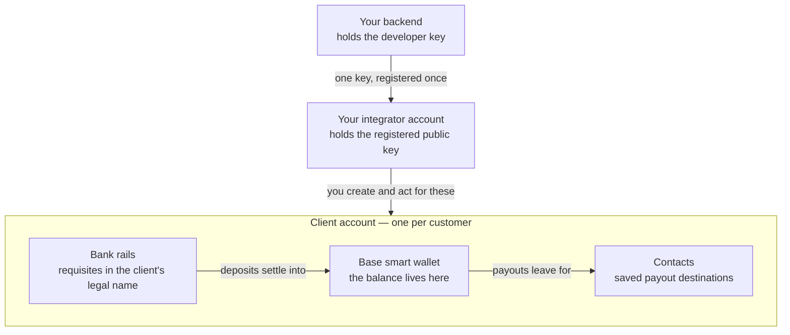

With the whitelabel API you open partner-bank payment details for your own customers and move their
money from your backend — no HEVN UI, no HEVN operator, no end-user signature.

## What you can build

- **A marketplace with on-chain escrow.** Lock a buyer's funds in a contract while a seller
  delivers, then capture them minus your fee.
- **A payroll or payables platform.** Collect from an employer, pay contractors to their own bank
  accounts in their own currencies.
- **An embedded payments account.** Give each of your customers payment details in their own company
  name, a balance, a statement and outgoing payments, under your brand.

## How it works

You hold one HEVN account — your **integrator account** — and it creates and controls other HEVN
accounts, one per customer. Those are your **clients**. Each client is a real account: it has a legal
identity you submit for review once, **rails** that produce requisites in its own name, a balance,
and a ledger.

Every client balance is a stablecoin balance on that client's own Base smart wallet. Fiat arriving
over a rail is converted by a partner bank and settles into that wallet; fiat leaving is the same
journey in reverse. See [How money moves](/whitelabel/how-money-moves).

Your backend authenticates with a **developer key** — a P-256 keypair whose private half never leaves
your server. You register its public half once, together with the source IPs it may be used from,
and the session it mints reaches this API and nothing else. The same key authorizes money movement:
HEVN builds each payment, echoes its exact terms, you check them and sign, HEVN executes. Nothing is
ever constructed by you, and nothing moves without your signature. See
[Developer key](/whitelabel/developer-key) and [Signing](/whitelabel/signing).

A client becomes usable by passing four gates in order — created, verification document complete,
application approved, rail active. After that, one payment is two calls: `POST /dapi/v1/payouts`
books and prices it, `POST /dapi/v1/payouts/{payoutId}/confirm` signs it.

Every route on these pages sits under `https://api.hevn.finance/dapi/v1`, or
`https://sandbox-api.hevn.finance/dapi/v1` in the sandbox. The spec is served by the API itself:
browse it at [`/dapi/v1/docs`](https://sandbox-api.hevn.finance/dapi/v1/docs) and fetch the schema
from `/dapi/v1/openapi.json`.

## What you get from HEVN, and what you keep

| You build | HEVN provides |
| --- | --- |
| Your product, your UI, your customer relationship | The account records, the partner-bank rails, the on-chain balances, the ledger |
| The onboarding form your customer fills in | The submission to the partner bank, and the review status you read back from it |
| The decision to pay, and the signature that authorizes it | The pricing, the operation, the execution and the receipt |

Two things HEVN switches on for you rather than the API: your integrator account itself, and the
permission to create clients. Both are a conversation, in the sandbox as in production — see
[Going live](/whitelabel/going-live).

## Where to start

<CardGroup cols={3}>
  <Card title="Quickstart" icon="rocket" href="/whitelabel/quickstart">
    Nine steps in the sandbox: a client company that holds testnet USDC and has sent some of it out, signed by your key.
  </Card>
  <Card title="How money moves" icon="route" href="/whitelabel/how-money-moves">
    One diagram and five rules: where a balance lives, who converts fiat, what is never instant.
  </Card>
  <Card title="Accounts and control" icon="shield" href="/whitelabel/accounts-and-control">
    Who can move a client's money, what HEVN cannot do alone, and what happens if your key leaks.
  </Card>
</CardGroup>
