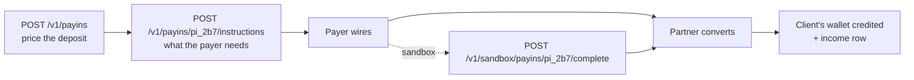

import ActingAsSnippet from "/snippets/acting-as.mdx";
import PollSnippet from "/snippets/poll.mdx";
import SandboxCapsSnippet from "/snippets/sandbox-caps.mdx";

Money arrives three ways: a quoted deposit you priced, an unsolicited wire to open requisites, or crypto sent straight to the wallet. All three end as one income row on the client's ledger.

| Shape | What you call | What the payer needs |
| --- | --- | --- |
| **Quoted deposit** | `POST /v1/payins`, then `POST /v1/payins/{payinId}/instructions` | The instructions that quote returns, payment reference included |
| **Unsolicited wire** | Nothing — the rail is a standing account | The `requisites` on the client's active rail from `GET /v1/banks` |
| **Crypto** | Nothing | The client's `baseSmartWallet` address |

Quote a deposit when you need the rate and the fee pinned before the payer pays, and when you want their transfer attributed to one order. Take the unsolicited path when the client publishes its own bank details and reconciles afterwards.



<ActingAsSnippet />

## Quote a deposit

The client needs an **active rail** in the currency the payer sends — see [Bank accounts](/whitelabel/bank-accounts).

<Steps>
  <Step title="Price the deposit">
    <CodeGroup>
    ```bash cURL
    curl -s -X POST "$HEVN_API/payins" \
      -H "Authorization: Bearer $HEVN_ACCESS_TOKEN" \
      -H "X-Hevn-Account: $HEVN_CLIENT_ID" \
      -H "Content-Type: application/json" \
      -d '{"amount":"2000.00","currency":"EUR","rail":"sepa","settlementToken":"EURC"}'
    ```

    ```python Python
    payin = northwind.post("/payins", {
        "amount": "2000.00",
        "currency": "EUR",
        "rail": "sepa",
        "settlementToken": "EURC",
    })
    ```

    ```javascript Node
    const payin = await northwind.post("/payins", {
      amount: "2000.00",
      currency: "EUR",
      rail: "sepa",
      settlementToken: "EURC",
    });
    ```

    ```go Go
    payin, err := northwind.Post("/payins", hevn.Body{
    	"amount":          "2000.00",
    	"currency":        "EUR",
    	"rail":            "sepa",
    	"settlementToken": "EURC",
    })
    ```
    </CodeGroup>

    ```json Response — 201, Location: /v1/payins/pi_2b7…
    { "id": "pi_2b7…", "status": "pending", "rail": "sepa",
      "quote": { "amount": "2000.00", "currency": "EUR",
                 "settlementAmount": "1989.50", "settlementToken": "EURC",
                 "feeAmount": "10.50", "feeCurrency": "EUR", "rate": "1.0000" },
      "expiresAt": "2026-09-17T10:06:11Z", "createdAt": "2026-09-17T10:04:11Z" }
    ```

    Three decisions:

    - **`amount` or `amountTo`, exactly one.** `amount` is what the payer sends in `currency`; `amountTo` is what should land on the wallet, and HEVN grosses the payer's side up to reach it.
    - **`rail` here is a payment *method*** — `sepa`, `ach`, `swift`, `fedwire`, `pix`, … — not the rail id you opened with `POST /v1/banks`. The two are different vocabularies; [Rails](/whitelabel/reference/rails) lists both.
    - **`settlementToken`** is the stablecoin the deposit is delivered in, `USDC` (the default) or `EURC`. It has to be a token one of the client's matching rails settles into; when it is not, the call refuses with the pairs that work (see below).

    The price holds until `expiresAt`. Read it; do not cache a quote.
  </Step>

  <Step title="Open it and read the instructions">
    <CodeGroup>
    ```bash cURL
    curl -s -X POST "$HEVN_API/payins/pi_2b7…/instructions" \
      -H "Authorization: Bearer $HEVN_ACCESS_TOKEN" \
      -H "X-Hevn-Account: $HEVN_CLIENT_ID" \
      -H "Content-Type: application/json" -d '{}'
    ```

    ```python Python
    instructions = northwind.post(f"/payins/{payin['id']}/instructions", {})
    ```

    ```javascript Node
    const instructions = await northwind.post(`/payins/${payin.id}/instructions`, {});
    ```

    ```go Go
    instructions, err := northwind.Post("/payins/"+payin.Str("id")+"/instructions", hevn.Body{})
    ```
    </CodeGroup>

    ```json Response — 200
    { "payinId": "pi_2b7…", "kind": "bank_transfer",
      "amount": "2000.00", "currency": "EUR",
      "paymentReference": "HEVN-7QF3K2", "singleUse": true,
      "requisites": { "fields": { "iban": "MT84…", "bic": "BANKMTMT" },
                      "holder": { "type": "business", "businessName": "Northwind Trading Ltd" },
                      "bankName": "Bank A", "state": "active" } }
    ```

    Hand `requisites` to the payer verbatim, **`paymentReference` included** — on a pooled account it is the only thing that attributes the money to this payin.

    `kind` says where the payer acts: `bank_transfer` (use `requisites`), `qr_code` (`qrPayload`), `hosted_page` (`url`) or `manual`. `singleUse: true` means these instructions belong to this payin alone.

    Opening the same payin again returns the same instructions — that is the safe retry, not a way to create a second payin. Once the price stops holding it answers `410 payin_expired`; quote again.
  </Step>

  <Step title="Watch it settle">
    `GET /v1/payins/{payinId}` carries the payin through its whole life. Settlement is driven by the partner's own reports, so poll it rather than waiting on a response.

    <PollSnippet />

    | `status` | Meaning |
    | --- | --- |
    | `pending` | Priced. Nothing has arrived. |
    | `awaitingFunds` | Open, instructions issued, waiting for the payer. |
    | `processing` | The partner has the money and is converting it. |
    | `inReview` | Held pending an information request about the payment. |
    | `completed` | Settled. The tokens are on the client's wallet. |
    | `failed`, `canceled` | It will not arrive. Quote again. |
    | `refunded` | Returned to the payer. |
  </Step>
</Steps>

## What a rail converts at

`GET /v1/banks/{rail}/rate` answers `{currency, rate, fixedFee, fixedFeeCurrency}` — the indicative price of a deposit over that rail. On a rail the client has not opened, only `currency` comes back. Use it to show a rate in your own UI before the payer commits to an amount. It is indicative: `POST /v1/payins` returns the number you are held to.

## When the payer has to be named

Some rails require the payer's own account so the receiving bank can check the sender. `POST /v1/payins/{payinId}/instructions` takes it:

```json
{ "payer": { "method": "sepa",
             "requisites": { "method": "sepa", "currency": "EUR",
                             "fields": { "iban": "DE89370400440532013000", "bic": "COBADEFFXXX" },
                             "holder": { "type": "business", "businessName": "Payer GmbH" } } } }
```

`payer.requisites.method` has to equal `payer.method`. When a rail needs the payer and you omit it, the call answers `400 invalid_request` and names the fields it wants in `message` — that refusal carries no `details`. `details.options[].payerRequired` on a refused quote is the part you can branch on, and it tells you in advance which pairs demand a payer.

## When a pair cannot be paid

A currency and method the client cannot be paid in answers `422 payin_not_available`, and `details.options` carries every pair that **can** — each with `rail`, `currency`, `available`, `minAmount`, `maxAmount`, `feeBps`, `fixedFee`, `payerRequired` and `settlementTokens`. Read the options rather than pre-flighting: the refusal is the capability catalogue.

`410 payin_expired` and `404 payin_not_found` are the other two you will meet; both carry `details.payinId`. [Errors](/whitelabel/reference/errors#rails-and-payins) has the rest.

## Unsolicited wires to the client's requisites

An active rail is a standing account. Anyone can wire to it with no quote and no API call from you.

1. Read `requisites` for the active rail from `GET /v1/banks`.
2. Give the payer the fields it carries, plus `paymentReference` when one is set.
3. The deposit lands as an income row on `GET /v1/transactions`, carrying `remitter` where the partner reports the sender, `paymentReference`, and the receiving requisites.

<Note>
  Some partners report no sender at all. When `remitter` is absent on a settled deposit, the sender cannot be recovered from the API — treat it as unknown rather than retrying.
</Note>

## Crypto straight to the wallet

The client's smart wallet is an ordinary address on Base. Read it from `GET /v1/clients/{clientId}/balance` as `baseSmartWallet` and publish it; anything sent there is the client's.

<Warning>
  Only **USDC and EURC on Base** are tracked. Other tokens, and the same tokens on other chains, sit at the address without ever becoming a balance or a transaction.
</Warning>

## In the sandbox

The partner is emulated, so a quoted payin waits forever until you complete it yourself. One call does what the payer would have done:

<CodeGroup>

```bash cURL
curl -s -X POST "$HEVN_API/sandbox/payins/pi_2b7f14c0a9/complete" \
  -H "Authorization: Bearer $HEVN_ACCESS_TOKEN" \
  -H "X-Hevn-Account: $HEVN_CLIENT_ID" \
  -H "Content-Type: application/json" \
  -d '{"remitter":"Payer GmbH"}'
```

```python Python
settled = northwind.post(f"/sandbox/payins/{payin['id']}/complete", {"remitter": "Payer GmbH"})
```

```javascript Node
const settled = await northwind.post(`/sandbox/payins/${payin.id}/complete`,
  { remitter: "Payer GmbH" });
```

```go Go
settled, err := northwind.Post("/sandbox/payins/"+payin.Str("id")+"/complete",
	hevn.Body{"remitter": "Payer GmbH"})
```

</CodeGroup>

`POST /v1/sandbox/deposits` covers the other two shapes: with `bankId` it emulates an unsolicited wire to that rail, without one it credits the smart wallet with tokens. Both are in [Sandbox](/whitelabel/sandbox#mint-money).

<SandboxCapsSnippet />

<Card title="Next: Payouts" icon="arrow-right" href="/whitelabel/payouts">
  Money out: price and book a bank payout in one call, sign it in the next.
</Card>
