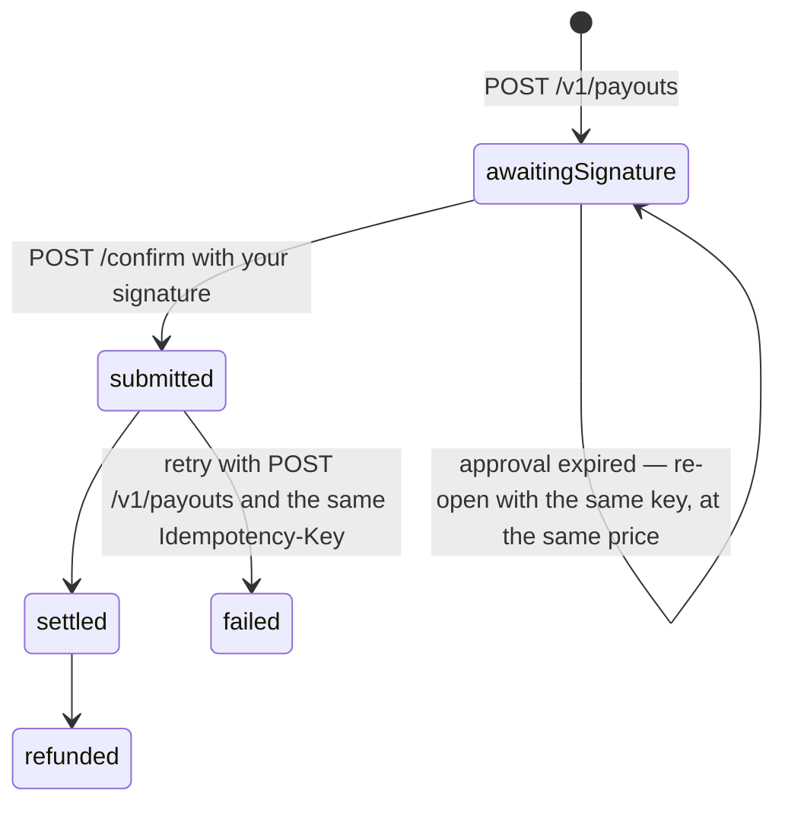

import ActingAsSnippet from "/snippets/acting-as.mdx";
import ConfirmLoopSnippet from "/snippets/confirm-loop.mdx";
import IdempotencySnippet from "/snippets/idempotency.mdx";
import PollSnippet from "/snippets/poll.mdx";
import SandboxCapsSnippet from "/snippets/sandbox-caps.mdx";
import SignPayloadSnippet from "/snippets/sign-payload.mdx";

Two calls move money: `POST /v1/payouts` prices and books it, `POST /v1/payouts/{payoutId}/confirm` signs it. One resource pays a bank account and a wallet alike — the recipient decides which route runs, and you never pick. The side you typed is inviolable: HEVN pins the amount you sent and derives the other one.

<CodeGroup>
```python Python
northwind = hevn.acting_as(CLIENT_ID)

payout = northwind.post("/payouts", {
    "contactId": "ct_3K9…",
    "amount": "500.00",
    "publicKey": key.public_key,
    "paymentReference": "INV-2026-114",
}, idempotency_key="order-A-1187")

signature = key.sign_payload(payout["approval"]["payload"])
receipt = northwind.confirm_until_settled(f"/payouts/{payout['id']}/confirm", signature)
```

```javascript Node
const northwind = hevn.actingAs(clientId);

const payout = await northwind.post("/payouts", {
  contactId: "ct_3K9…",
  amount: "500.00",
  publicKey: key.publicKey,
  paymentReference: "INV-2026-114",
}, { idempotencyKey: "order-A-1187" });

const signature = key.signPayload(payout.approval.payload);
const receipt = await northwind.confirmUntilSettled(`/payouts/${payout.id}/confirm`, signature);
```

```go Go
northwind := api.ActingAs(clientID)

payout, err := northwind.Post("/payouts", hevn.Body{
	"contactId":        "ct_3K9…",
	"amount":           "500.00",
	"publicKey":        key.PublicKey,
	"paymentReference": "INV-2026-114",
}, hevn.IdempotencyKey("order-A-1187"))

signature, err := key.SignPayload(payout.Str("approval.payload"))
receipt, err := northwind.ConfirmUntilSettled("/payouts/"+payout.Str("id")+"/confirm", signature)
```
</CodeGroup>

Examples use the client from [HTTP client](/whitelabel/reference/client). `acting_as` sets the one header that picks whose money moves:

<ActingAsSnippet />



## Save a recipient

A payout always pays a **contact** — a recipient you saved once and reuse. `POST /v1/contacts` takes the bank requisites in the same shape `GET /v1/banks` returns them, plus the beneficiary's own address.

<CodeGroup>
```bash cURL
curl -s -X POST "$HEVN_API/contacts" \
  -H "Authorization: Bearer $HEVN_ACCESS_TOKEN" \
  -H "X-Hevn-Account: $HEVN_CLIENT_ID" \
  -H "Content-Type: application/json" \
  -d '{"name":"Ardenne Fabrication SARL",
       "bank":{"method":"sepa","currency":"EUR",
               "fields":{"iban":"FR7630006000011234567890189"},
               "holder":{"type":"business","businessName":"Ardenne Fabrication SARL"}},
       "address":{"country":"FR","city":"Lyon","streetAddress":"12 Rue Garibaldi","zip":"69006"}}'
```

```python Python
recipient = northwind.post("/contacts", {
    "name": "Ardenne Fabrication SARL",
    "bank": {
        "method": "sepa",
        "currency": "EUR",
        "fields": {"iban": "FR7630006000011234567890189"},
        "holder": {"type": "business", "businessName": "Ardenne Fabrication SARL"},
    },
    "address": {"country": "FR", "city": "Lyon", "streetAddress": "12 Rue Garibaldi", "zip": "69006"},
})
```

```javascript Node
const recipient = await northwind.post("/contacts", {
  name: "Ardenne Fabrication SARL",
  bank: {
    method: "sepa",
    currency: "EUR",
    fields: { iban: "FR7630006000011234567890189" },
    holder: { type: "business", businessName: "Ardenne Fabrication SARL" },
  },
  address: { country: "FR", city: "Lyon", streetAddress: "12 Rue Garibaldi", zip: "69006" },
});
```

```go Go
recipient, err := northwind.Post("/contacts", hevn.Body{
	"name": "Ardenne Fabrication SARL",
	"bank": hevn.Body{
		"method":   "sepa",
		"currency": "EUR",
		"fields":   hevn.Body{"iban": "FR7630006000011234567890189"},
		"holder":   hevn.Body{"type": "business", "businessName": "Ardenne Fabrication SARL"},
	},
	"address": hevn.Body{"country": "FR", "city": "Lyon", "streetAddress": "12 Rue Garibaldi", "zip": "69006"},
})
```
</CodeGroup>

```json Response — 201, Location: /v1/contacts/ct_3K9…
{ "id": "ct_3K9…", "name": "Ardenne Fabrication SARL", "isExternal": true,
  "createdAt": "2026-09-17T10:04:11Z",
  "bank": { "method": "sepa", "currency": "EUR",
            "fields": { "iban": "FR7630006000011234567890189" },
            "holder": { "type": "business", "businessName": "Ardenne Fabrication SARL" },
            "state": "active" },
  "address": { "country": "FR", "city": "Lyon", "streetAddress": "12 Rue Garibaldi", "zip": "69006" } }
```

Four decisions live here:

- **A bank contact needs a complete recipient address.** Without `country`, `city`, `streetAddress` and `zip` the call answers `422 contact_details_invalid`, listing them in `details.fields`. Which identifiers `fields` must carry depends on the method — see [Rails](/whitelabel/reference/rails).
- **The same requisites create one contact.** A second `POST` answers `200` with `Idempotency-Replayed: true` and the original `ct_…`, so a retried create never forks a recipient.
- **Correct a recipient with `PATCH /v1/contacts/{contactId}`, never by re-creating it.** Name, address and holder are editable, the account identifiers are not; a misspelled beneficiary name is refused by the partner, not by the contact, so this is the repair path.
- **`DELETE /v1/contacts/{contactId}` forgets the recipient** and returns the record it removed. Payouts already booked keep their own `recipient`, so a delete never rewrites history. `GET /v1/contacts` lists what you have, cursor-paged.

Two optional reads price a payout before you book one. `GET /v1/contacts/{contactId}/capabilities?amount=500.00` reports one `options` row per payable account — `method`, `currency`, `minAmount`, `maxAmount`, `feeBps`, `fixedFee`, and whether `purpose`, a memo or documents are required. `POST /v1/payouts/preview` takes `{"rail", "amount"}` and prices a **rail** with no recipient and no side effects. Neither is a gate: `POST /v1/payouts` refuses the same cases on its own, and its numbers are the ones you are held to.

## Move the money

<Steps>
  <Step title="Price and book the payout">
    One call quotes the payout, books it with the partner, and prepares the operation you sign.

    <CodeGroup>
    ```bash cURL
    curl -s -X POST "$HEVN_API/payouts" \
      -H "Authorization: Bearer $HEVN_ACCESS_TOKEN" \
      -H "X-Hevn-Account: $HEVN_CLIENT_ID" \
      -H "Idempotency-Key: order-A-1187" \
      -H "Content-Type: application/json" \
      -d '{"contactId":"ct_3K9…","amount":"500.00",
           "publicKey":"'"$HEVN_PUBLIC_KEY"'","paymentReference":"INV-2026-114"}'
    ```

    ```python Python
    payout = northwind.post("/payouts", {
        "contactId": recipient["id"],
        "amount": "500.00",
        "publicKey": key.public_key,
        "paymentReference": "INV-2026-114",
    }, idempotency_key="order-A-1187")
    ```

    ```javascript Node
    const payout = await northwind.post("/payouts", {
      contactId: recipient.id,
      amount: "500.00",
      publicKey: key.publicKey,
      paymentReference: "INV-2026-114",
    }, { idempotencyKey: "order-A-1187" });
    ```

    ```go Go
    payout, err := northwind.Post("/payouts", hevn.Body{
    	"contactId":        recipient.Str("id"),
    	"amount":           "500.00",
    	"publicKey":        key.PublicKey,
    	"paymentReference": "INV-2026-114",
    }, hevn.IdempotencyKey("order-A-1187"))
    ```
    </CodeGroup>

    ```json Response — 201, Location: /v1/payouts/po_4c8a…
    {
      "id": "po_4c8a…",
      "kind": "fiat",
      "status": "awaitingSignature",
      "idempotencyKey": "order-A-1187",
      "quote": { "fromAmount": "500.00", "fromCurrency": "USD",
                 "toAmount": "459.31", "toCurrency": "EUR",
                 "rate": "0.9247", "feeAmount": "1.00", "feeCurrency": "USD",
                 "expiresAt": "2026-09-17T10:06:11Z" },
      "approval": { "id": "…", "payload": "eyJ…", "expiresAt": "2026-09-17T10:06:10Z" },
      "debit": { "address": "0x8f3b…", "amount": "500.00", "amountAtomic": "500000000",
                 "token": "USDC", "chainId": 8453 },
      "recipient": { "contactId": "ct_3K9…", "name": "Ardenne Fabrication SARL" }
    }
    ```

    | Decision | Field |
    | --- | --- |
    | Which side of the conversion you pin | `amount` is what leaves the client's balance, `amountTo` is what the beneficiary receives. Send exactly one. HEVN never adjusts the side you sent — it derives the other one through the partner's own fee formula. |
    | Which registered key will sign | `publicKey`. A real choice while you rotate keys, which is why it is on the opening call and not on confirm. |
    | What the beneficiary sees | `paymentReference`, up to 140 characters. |
    | What the destination rail demands | `purpose` when `capabilities` reports `purposeRequired`, and up to ten `documentIds` from [document upload](/whitelabel/onboarding) when it reports `documentsRequired`. |
    | Which of several accounts to pay | `bankId` (`bnk_…`), the same id `capabilities` returns on each option, when a recipient has more than one. Omit it and HEVN picks the account `capabilities` would pick. |

    Amounts are decimal strings in the major unit — `"500.00"`, never `500` and never atomic units. More precision than the asset allows is refused, never rounded ([Conventions](/whitelabel/conventions#money)).
  </Step>

  <Step title="Check the debit, then sign">
    `debit` is not an echo of your request. It is decoded out of the [operation you are about to sign](/whitelabel/signing): `address` is the HEVN treasury address that will be paid, `amount` and `amountAtomic` are what will leave the client's wallet, in `token` on chain `chainId`. Compare it against your own record and raise if it drifted — this is the one cross-check a signer has.

    <SignPayloadSnippet />

    Then confirm. The body is the signature over the **decoded** `approval.payload` bytes:

    <CodeGroup>
    ```python Python
    if payout["debit"]["amount"] != order.usdc_total or payout["debit"]["token"] != "USDC":
        raise DebitDrift(payout["id"], payout["debit"])

    signature = key.sign_payload(payout["approval"]["payload"])
    receipt = northwind.post(f"/payouts/{payout['id']}/confirm", {"signature": signature})
    ```

    ```javascript Node
    if (payout.debit.amount !== order.usdcTotal || payout.debit.token !== "USDC") {
      throw new DebitDrift(payout.id, payout.debit);
    }
    const signature = key.signPayload(payout.approval.payload);
    const receipt = await northwind.post(`/payouts/${payout.id}/confirm`, { signature });
    ```

    ```go Go
    if payout.Str("debit.amount") != order.USDCTotal || payout.Str("debit.token") != "USDC" {
    	return fmt.Errorf("debit drift on %s", payout.Str("id"))
    }
    signature, err := key.SignPayload(payout.Str("approval.payload"))
    receipt, err := northwind.Post("/payouts/"+payout.Str("id")+"/confirm",
    	hevn.Body{"signature": signature})
    ```
    </CodeGroup>

    ```json Response — 200
    { "id": "po_4c8a…", "kind": "fiat", "status": "settled",
      "transactionHash": "0x4f1c…" }
    ```

    Three answers are possible, and all three are terminal for the call:

    | Status | Body | What it means |
    | --- | --- | --- |
    | `200` | `status: "settled"`, `transactionHash` | The debit landed on chain and the payout is with the partner. |
    | `200` | `status: "failed"`, `transactionHash`, `failure.code` | The operation reverted on chain. Nothing moved. Book it again with `POST /v1/payouts` and the same `Idempotency-Key`. |
    | `202` | `status: "submitted"`, `pollUrl` | Sent, no receipt yet. Read `pollUrl` or confirm again — both are safe. |

    `publicKey` is optional in the confirm body and only skips a key scan: HEVN verifies your signature locally, against the payload it stored, before it consumes anything. A wrong signature never burns the approval.
  </Step>

  <Step title="Track it to completion">
    `GET /v1/payouts/{payoutId}` answers for the whole lifecycle, bank and wallet alike, and it is the route a `pollUrl` names.

    ```json Response — 200
    { "id": "po_4c8a…", "kind": "fiat", "status": "settled",
      "quote": { "fromAmount": "500.00", "fromCurrency": "USD",
                 "toAmount": "459.31", "toCurrency": "EUR", "rate": "0.9247" },
      "transactionHash": "0x4f1c…", "transactionId": "txn_9e4…",
      "recipient": { "contactId": "ct_3K9…", "name": "Ardenne Fabrication SARL" },
      "paymentReference": "INV-2026-114",
      "createdAt": "2026-09-17T10:04:11Z", "settledAt": "2026-09-17T10:04:39Z" }
    ```

    | `status` | Meaning |
    | --- | --- |
    | `awaitingSignature` | Booked and priced. The approval is open and nothing has moved. |
    | `submitted` | The funding operation was sent, or the partner is holding the transfer for a question (see `attention` below). |
    | `settled` | The debit landed and the partner accepted the payout. Delivery to the beneficiary's bank follows the rail's own clock. |
    | `failed` | The operation reverted, or the partner refused or canceled the transfer. `failure.code` says which. |
    | `refunded` | The partner sent the money back. It returns to the client's wallet. |

    `transactionId` appears once the payout is projected into the client's ledger; read it with `GET /v1/transactions/{transactionId}` ([Balances and transactions](/whitelabel/balances-and-transactions)). `attention: {"kind": "rfi", "url": …}` means the partner is holding the transfer pending an information request — the payout is not lost, and nothing you sign will move it until the request is answered.

    <PollSnippet />
  </Step>
</Steps>

## Pay a wallet instead of a bank

There is one payout resource. `POST /v1/payouts` reads the recipient and picks the route: a bank contact is quoted and booked with a partner, a wallet contact is sent USDC on Base straight out of the client's wallet. Same body, same `approval.payload`, same confirm route, same `GET /v1/payouts/{payoutId}`.

<CodeGroup>
```python Python
payout = northwind.post("/payouts", {
    "contactId": "ct_9a…",
    "amount": "1.50",
    "publicKey": key.public_key,
}, idempotency_key="payout-A-1187-onchain")

signature = key.sign_payload(payout["approval"]["payload"])
receipt = northwind.confirm_until_settled(f"/payouts/{payout['id']}/confirm", signature)
```

```javascript Node
const payout = await northwind.post("/payouts", {
  contactId: "ct_9a…",
  amount: "1.50",
  publicKey: key.publicKey,
}, { idempotencyKey: "payout-A-1187-onchain" });

const signature = key.signPayload(payout.approval.payload);
const receipt = await northwind.confirmUntilSettled(`/payouts/${payout.id}/confirm`, signature);
```

```go Go
payout, err := northwind.Post("/payouts", hevn.Body{
	"contactId": "ct_9a…",
	"amount":    "1.50",
	"publicKey": key.PublicKey,
}, hevn.IdempotencyKey("payout-A-1187-onchain"))

signature, err := key.SignPayload(payout.Str("approval.payload"))
receipt, err := northwind.ConfirmUntilSettled("/payouts/"+payout.Str("id")+"/confirm", signature)
```
</CodeGroup>

### Save an address as a contact

<CodeGroup>
```bash cURL
curl -s -X POST "$HEVN_API/contacts" \
  -H "Authorization: Bearer $HEVN_ACCESS_TOKEN" \
  -H "X-Hevn-Account: $HEVN_CLIENT_ID" \
  -H "Content-Type: application/json" \
  -d '{"name":"Ardenne treasury","crypto":{"chain":"base","token":"USDC","address":"0x7c1d…"}}'
```

```python Python
recipient = northwind.post("/contacts", {
    "name": "Ardenne treasury",
    "crypto": {"chain": "base", "token": "USDC", "address": "0x7c1d…"},
})
```

```javascript Node
const recipient = await northwind.post("/contacts", {
  name: "Ardenne treasury",
  crypto: { chain: "base", token: "USDC", address: "0x7c1d…" },
});
```

```go Go
recipient, err := northwind.Post("/contacts", hevn.Body{
	"name":   "Ardenne treasury",
	"crypto": hevn.Body{"chain": "base", "token": "USDC", "address": "0x7c1d…"},
})
```
</CodeGroup>

A wallet contact needs no recipient address on file — the chain is the address. Only **USDC on Base** can be paid from a client balance: another chain answers `422 recipient_chain_unsupported` with `details.chain`, another token answers `422 recipient_token_unsupported` with `details.token`, and neither is ever routed or converted silently. A contact saved by `email` also works when that email belongs to a HEVN account: HEVN resolves it to that account's wallet.

### What comes back

```json Response — 201, Location: /v1/payouts/po_6d21…
{
  "id": "po_6d21…",
  "kind": "onchain",
  "status": "awaitingSignature",
  "idempotencyKey": "payout-A-1187-onchain",
  "quote": { "fromAmount": "1.50", "fromCurrency": "USDC",
             "toAmount": "1.50", "toCurrency": "USDC" },
  "approval": { "id": "…", "payload": "eyJ…", "expiresAt": "2026-09-17T10:06:10Z" },
  "debit": { "address": "0x7c1d…", "amount": "1.50", "amountAtomic": "1500000",
             "token": "USDC", "chainId": 8453 },
  "recipient": { "contactId": "ct_9a…", "name": "Ardenne treasury", "address": "0x7c1d…" }
}
```

Two differences from a bank payout matter.

**`quote` carries no `rate`, no `feeAmount` and no `expiresAt`.** Nothing is converted and no partner priced anything, so those fields are absent rather than filled with `1` and `0`. `fromAmount` and `toAmount` are the same number because they are the same money.

**`debit.address` is the recipient's address**, not the HEVN treasury. There is no conversion and no intermediary, so the address decoded out of the operation is the address the USDC lands on. Compare it against the contact you meant to pay before you sign — same habit, same reason.

`amount` is a decimal string with at most six fractional digits, the precision USDC has on chain. More than that answers `422 validation_failed` with `details.fields[0].code = "amount_precision"` — never a rounded payout.

Two refusals belong to this route alone: `409 self_transfer` when the address resolves to the client's own wallet, and `409 insufficient_funds` when the balance does not cover the amount (there is no fiat leg to absorb it).

A confirmed wallet payout carries `transactionHash`, and the durable record is the client's ledger: the row shows up with `isIncome: false` and `type: "crypto"` — or `internal`, when the address belongs to another HEVN account. Read it through `GET /v1/transactions` ([Balances and transactions](/whitelabel/balances-and-transactions#walk-the-ledger)).

## Retries and idempotency

`POST /v1/payouts` books money at a partner, so a retry must not book twice. `Idempotency-Key` is how you say "this is the same payout".

<IdempotencySnippet />

- **Same key, same terms** → `200` with `Idempotency-Replayed: true`, the same `po_…`, the agreed price, and a **fresh approval** if the previous one expired. One recovery path for a lost response and for an expired approval alike.
- **Same key, different terms** → `409 idempotency_key_reused` with `details.payoutId`. Contact, account, pinned side and amount all have to match.
- **No key at all** → HEVN derives one from the request and echoes it as `idempotencyKey`. Inside its window a retry replays instead of paying twice; outside it, two payouts happen. An explicit key holds far longer; [Limits](/whitelabel/reference/limits#idempotency) has both windows.

Re-opening is bounded: after several expired approvals the next `POST /v1/payouts` answers `409 funding_attempts_exhausted`, and the payout has to be re-quoted under a new key.

<Warning>
  Never rotate the key on a retry, and never derive it from a clock or a random value. A fresh key on the retry of a payment you already sent is how the same invoice gets paid twice.
</Warning>

## When a payout is refused

Booking refusals arrive at `POST /v1/payouts` and are about the recipient, the amount or the route:

| `code` | Status | What to do |
| --- | --- | --- |
| `contact_not_found` | 404 | The `ct_…` is unknown, deleted, or belongs to another account. |
| `invalid_request` | 400 | The route refused these terms and `message` says which — below the route's minimum, a direction it cannot price, requisites the method does not satisfy. Fix the input and call again with the same key. |
| `validation_failed` | 422 | The body itself is wrong: both `amount` and `amountTo`, neither of them, more precision than the asset allows, or a key the schema does not know. `details.fields` names each one. |
| `payout_not_fundable` | 409 | Booked, but the route cannot be funded with a developer key. Re-quote with a new key on a rail that can. |
| `provider_unavailable` | 503 | The partner is down. Retry with the same key. |

A `400` or `422` lands before anything is booked, so the same key stays free for the corrected request.

Funding refusals arrive at `confirm`, and each has exactly one correct response:

| `code` | Status | What to do |
| --- | --- | --- |
| `already_funded` | 409 | **Treat as success.** The money moved; `details.transactionHash` is the proof. Never re-open. |
| `funding_in_progress` | 409 | Wait, then confirm again. An attempt is still in flight. |
| `funding_attempt_expired` | 409 | The approval expired. Re-open with `POST /v1/payouts` and the same key, then sign the new payload. |
| `insufficient_funds` | 409 | The client's USDC balance does not cover the debit. `details.available` and `details.required` are in atomic units. Fund the wallet and confirm again. |
| `bundler_rejected`, `bundler_unavailable` | 502 | Chain infrastructure. Confirm again with backoff. |
| anything else | — | Stop. Do not re-confirm and do not re-open; `funding_state_unknown` in particular means an earlier attempt may still land. Take it to support with the `X-Request-ID` of the response. |

That policy is one function, shared by every payout and by escrow actions, and stated once under [Retrying a confirm](/whitelabel/signing#retrying-a-confirm):

<ConfirmLoopSnippet />

The full slug registry, with every status code and message, is in [Errors](/whitelabel/reference/errors#payouts).

## In the sandbox

The sandbox books and signs as production does; the emulated partner settles nothing on its own. Move a booked payout yourself:

<CodeGroup>

```bash cURL
curl -s -X POST "$HEVN_API/sandbox/payouts/po_4c8a13d7f2/status" \
  -H "Authorization: Bearer $HEVN_ACCESS_TOKEN" \
  -H "X-Hevn-Account: $HEVN_CLIENT_ID" \
  -H "Content-Type: application/json" \
  -d '{"status":"settled"}'
```

```python Python
moved = northwind.post(f"/sandbox/payouts/{payout['id']}/status", {"status": "settled"})
```

```javascript Node
const moved = await northwind.post(`/sandbox/payouts/${payout.id}/status`, { status: "settled" });
```

```go Go
moved, err := northwind.Post("/sandbox/payouts/"+payout.Str("id")+"/status",
	hevn.Body{"status": "settled"})
```

</CodeGroup>

`status` takes the payout vocabulary — `submitted`, `settled`, `failed` or `refunded` — and `refunded` returns the money to the client's wallet, which is the cheapest way to test your reconciliation.

<SandboxCapsSnippet />

<Card title="Next: Balances and transactions" icon="arrow-right" href="/whitelabel/balances-and-transactions">
  Read a client's balance, walk its ledger with a cursor, export a statement.
</Card>
