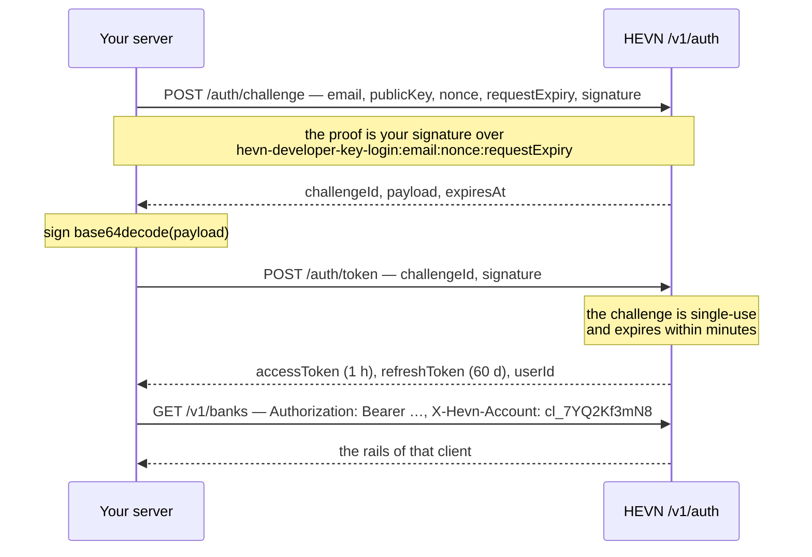

One developer key, two calls to log in, one header to act as a client.



## Log in

Two calls, two signatures, no browser.

**`POST /v1/auth/challenge`** proves you hold the key. Sign the proof string
`hevn-developer-key-login:{email}:{nonce}:{requestExpiry}` with your developer key and send it with
the public key you registered. `nonce` is any integer you have not used before; `requestExpiry` is a
millisecond timestamp at most five minutes in the future.

```json
{
  "email": "integrator@example.com",
  "publicKey": "MFkwEwYHKoZIzj0CAQYIKoZIzj0DAQcDQgAE…",
  "nonce": 481923756104,
  "requestExpiry": 1773679531000,
  "signature": "MEUCIQDk3f8Zc0xq2w1Yv7pB9nH4mJ6sR2tL5uD8aE0cQ1oXgAIg…"
}
```

The answer is a payload HEVN built for you:

```json
{ "challengeId": "9f2c1ab8-4d7e-4f1f-a3c6-5b0e7d9a2c41", "payload": "eyJib2R5Ijp…", "expiresAt": "2026-09-17T10:06:10Z" }
```

**`POST /v1/auth/token`** exchanges your signature over that payload for a session. Sign the
*decoded* bytes of `payload`, exactly as at payment time — [Signing](/whitelabel/signing) is the same
mechanism.

```json
{ "challengeId": "9f2c1ab8-4d7e-4f1f-a3c6-5b0e7d9a2c41", "signature": "MEQCIF3q…" }
```

```json Response
{ "accessToken": "eyJ…", "refreshToken": "eyJ…", "expiresIn": 3600, "userId": "cl_9f2c1ab84d7e4f1fa3c65b0e7d9a2c41" }
```

The challenge is single-use and dies with its `expiresAt`: two `/auth/token` calls on one
`challengeId` answer `409 challenge_consumed`. `userId` is your own account's id, and you can use it
wherever a client id is accepted for your own account.

import LoginSnippet from "/snippets/login.mdx";

<LoginSnippet />

## Two tokens, two jobs

| Token | Lifetime | What it is for |
| --- | --- | --- |
| `accessToken` | **1 hour** (`expiresIn: 3600`) | Every call: `Authorization: Bearer <accessToken>` |
| `refreshToken` | **60 days** | One route only: `POST /v1/auth/refresh`, to mint a new access token |

Re-mint with the refresh token as the bearer and an empty body:

<CodeGroup>

```bash cURL
curl -X POST "$HEVN_API/auth/refresh" \
  -H "Authorization: Bearer $HEVN_REFRESH_TOKEN" \
  -H "Content-Type: application/json" -d '{}'
```

```python Python
minted = httpx.post(f"{os.environ['HEVN_API']}/auth/refresh", json={},
                    headers={"Authorization": f"Bearer {refresh_token}"})
minted.raise_for_status()
access_token = minted.json()["accessToken"]
```

```javascript Node
const minted = await fetch(`${process.env.HEVN_API}/auth/refresh`, {
  method: "POST",
  headers: { authorization: `Bearer ${refreshToken}`, "content-type": "application/json" },
  body: "{}",
});
if (!minted.ok) throw new Error(`refresh ${minted.status}`);
const { accessToken } = await minted.json();
```

```go Go
var minted hevn.Tokens
err := hevn.PostJSON(os.Getenv("HEVN_API")+"/auth/refresh", map[string]any{},
	&minted, hevn.Bearer(refreshToken))
accessToken := minted.AccessToken
```

</CodeGroup>

```json Response
{ "accessToken": "eyJ…", "expiresIn": 3600, "userId": "cl_9f2c…" }
```

This is the one call that does not go through the client: it carries the refresh token, not the
access token. [The reference client](/whitelabel/reference/client#hold-the-session) wraps it in a
`Session` so the request layer never thinks about expiry.

Log in once per process, keep the refresh token in your secret store, and re-mint the access token
about a minute before it expires. A refresh token is not an API credential: sent to any other route
it is refused.

## Acting as a client

Send `X-Hevn-Account: cl_…` alongside your own access token, and the call reads and writes that
client. Omit it and the same call acts on your integrator account. One token covers every client you
control, so there is nothing to cache per client.

<CodeGroup>

```bash cURL
curl "$HEVN_API/transactions?limit=20" \
  -H "Authorization: Bearer $HEVN_ACCESS_TOKEN" \
  -H "X-Hevn-Account: cl_7YQ2Kf3mN8"
```

```python Python
rows = hevn.acting_as("cl_7YQ2Kf3mN8").get("/transactions", {"limit": 20})
```

```javascript Node
const rows = await hevn.actingAs("cl_7YQ2Kf3mN8").get("/transactions", { limit: 20 });
```

```go Go
rows, err := api.ActingAs("cl_7YQ2Kf3mN8").Get("/transactions", hevn.Query{"limit": "20"})
```

</CodeGroup>

The header is read exactly where the resource has no owner of its own in the path:

| Routes | The header |
| --- | --- |
| `/banks*`, `/payins*`, `/payouts*`, `/transfers*`, `/contacts*`, `/transactions*`, `/documents`, and the `/sandbox` money routes | **Accepted, optional.** Without it the call acts on your account |
| `/clients/{clientId}` and everything under it — `/kyb`, `/kyb/submit`, `/balance` | **Refused** unless it equals the client id already in the path. The path is the scope |
| `POST /clients`, `GET /clients` | **Refused.** These are about your own account by definition |
| `/auth/*` | **Ignored.** A login has no account to act for yet, so the header is neither read nor refused |
| All of `/escrow*` | **Refused.** A deal names `senderClientId` and `receiverClientId` in the body; the operator is always you |

Sending the header where it is refused is an error rather than a silent no-op, so you find out in
development:

| Status | `code` | Cause |
| --- | --- | --- |
| 400 | `account_header_invalid` | The value is not a `cl_…` client id |
| 400 | `account_scope_conflict` | The route is scoped to your account, or the header disagrees with the path |
| 404 | `account_not_found` | Not one of your clients — unknown and foreign are indistinguishable on purpose |
| 403 | `account_forbidden` | The client exists and is yours, but your integrator standing or the relationship is not current |

<Note>
  `POST /v1/auth/refresh` also accepts `{"userId": "cl_…"}` and mints an access token scoped to that
  one client. It still works, and it is no longer the documented path: it costs one token mint per
  client per hour and buys nothing the header does not give you.
</Note>

## What a session is bound to

- **An environment.** Sandbox tokens are refused in production and the reverse.
- **Your key's standing at the time of the call.** Rotating or revoking a developer key stops new
  signatures immediately; it does not cut tokens already issued. See
  [Developer key](/whitelabel/developer-key#rotate-a-key).
- **A budget.** Reads and writes are limited per credential, and login has its own per-IP and
  per-email windows — over them is `429` with `Retry-After`. The numbers are in
  [Limits](/whitelabel/reference/limits#rate-limits). Logging in on a loop is the fastest way to lock
  yourself out; log in once and re-mint.

<Card title="Next: Conventions" icon="list-checks" href="/whitelabel/conventions">
  The seven rules that hold for every operation: money, ids, casing, idempotency, pagination, status
  codes, errors.
</Card>
