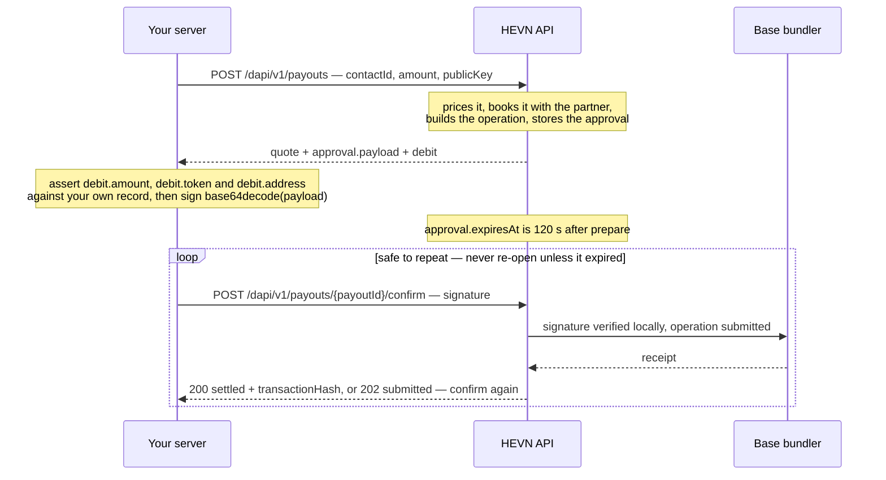

Nothing you sign is constructed by you. HEVN builds the operation, echoes its terms, and verifies the
same terms again at confirm — your job is to check the echo and sign, not to assemble a transaction.

<Steps>
  <Step title="Prepare" icon="file-text">
    You call the opening route — `POST /dapi/v1/payouts` or
    `POST /dapi/v1/escrow/{escrowId}/actions`. HEVN prices the payment, books it, builds the on-chain
    operation and stores an approval. The response carries `quote`, `approval` and `debit`.
  </Step>
  <Step title="Check" icon="scale">
    Compare `debit.amount`, `debit.token` and `debit.address` with the payment your own system
    intended, and refuse if they differ. This is the one guarantee the design cannot give you.
  </Step>
  <Step title="Sign" icon="pen-tool">
    Base64-decode `approval.payload` and sign **those exact bytes**: ECDSA P-256 over SHA-256,
    DER-encoded, base64 out.
  </Step>
  <Step title="Confirm" icon="check">
    Post the signature to the matching confirm route inside the approval window. HEVN verifies it
    locally, co-signs, and submits.
  </Step>
</Steps>



## Where the mechanism is used

| What moves | Prepare | Confirm | Approval window |
| --- | --- | --- | --- |
| Fiat out over a bank rail | `POST /dapi/v1/payouts` | `POST /dapi/v1/payouts/{payoutId}/confirm` | 120 s |
| USDC out on Base | `POST /dapi/v1/payouts` with a wallet contact | `POST /dapi/v1/payouts/{payoutId}/confirm` | 120 s |
| An escrow deal, and every escrow action | `POST /dapi/v1/escrow`, `POST /dapi/v1/escrow/{escrowId}/actions` | `POST /dapi/v1/escrow/{escrowId}/actions/{idempotencyKey}/confirm` | 60 s |

Payouts act on a client — send `X-Hevn-Account`. Escrow is always operated by you, so it
refuses that header. Every confirm body is the same two fields:

```json
{ "signature": "MEUCIQD…", "publicKey": "MFkwEwYHKoZIzj0CAQYIKoZIzj0DAQcDQgAE…" }
```

`publicKey` is optional; it only saves HEVN a scan over your account's keys. A key that is not one
of them is `403 key_not_registered` — see [Developer key](/whitelabel/developer-key#when-a-key-is-refused).

Every other call in these guides carries a cURL tab. The confirms do not: a signature is produced by
your key over bytes HEVN just handed you, so a curl block could only show a stale one. The prepare
call has a cURL tab, the confirm is Python, Node and Go.

## What you sign

`approval.payload` is base64 of a canonical JSON document — the authorization HEVN will execute on
your behalf. Decoded, one from a payout looks like this (formatted here to read; the real bytes carry
no whitespace):

```json
{
  "body": {
    "method": "secp256k1_sign",
    "params": { "hash": "0x9c1f7b4a2e5d80c6314fa7b95d0e28c4f61ab3907d5c2e84061bf39d7a2c5e18" }
  },
  "headers": {
    "privy-idempotency-key": "quote-sign:5f3c…e1",
    "privy-request-expiry": "1773679531000"
  },
  "method": "POST",
  "url": "…",
  "version": 1
}
```

<Warning>
  **Sign `base64decode(payload)` verbatim.** Never parse the JSON and re-serialize it. Any library
  that reorders keys, adds a space after `:`, escapes non-ASCII differently or appends a newline
  produces different bytes and a signature that is refused with `400 signature_invalid`.
</Warning>

## Signature format

| Rule | Value |
| --- | --- |
| Algorithm | ECDSA on **P-256**, digest **SHA-256** |
| Encoding | **ASN.1 DER** `(r, s)` |
| Transport | **base64**, standard alphabet, padded |
| Content | Exactly one signature — no `,`, `\n` or `\r` anywhere in the string |

import SignPayloadSnippet from "/snippets/sign-payload.mdx";

<SignPayloadSnippet />

Five ways to get it wrong, all of them answering `400 signature_invalid`:

- **Raw `r‖s`.** WebCrypto and Java's `SHA256withECDSAinP1363Format` produce a fixed 64-byte
  signature. Convert it to DER before encoding.
- **base64url.** `-` and `_` are rejected; keep the standard alphabet and the `=` padding.
- **Whitespace.** Do not wrap the base64 at 64 columns, and do not let a shell pipeline append a
  newline.
- **Signing the string.** Sign the decoded bytes, not the base64 text.
- **Hashing twice.** Most libraries hash for you. Do not pre-hash and then sign the digest as a
  message.

Sign on your server. The key can authorize a spend from every client wallet you control, so a browser
is the wrong place for it.

## What HEVN binds, and what it verifies

You are not trusted to describe the operation, and you are not asked to. At prepare, HEVN:

- loads the target itself — the booked payout, the contact you named, the deal — and refuses anything
  that is not in a fundable state;
- checks that your account controls the client's wallet and that the wallet's live on-chain owner is
  your signer;
- builds a **single stablecoin transfer** from the client's wallet, with the amount and destination
  taken from what it just booked, and checks the balance covers it;
- re-validates that built operation against the stored terms before it hands you anything to sign;
- pins an idempotency key of its own on the authorization, so the same signature cannot be replayed
  as a different request;
- binds the approval to your account, the target, the wallet and your signer, and stores it with an
  expiry.

At confirm, your signature is verified **locally** against the stored bytes before anything is
consumed. A wrong signature is a refusal that costs you nothing: the approval survives, and you can
fix the signing and confirm again.

The credential is re-checked at both ends. Every request on this API re-reads the developer key behind
your session, the address the request came from and the scopes the key holds, and the confirm
re-checks them once more immediately before HEVN co-signs — so a key deleted between the prepare and
the confirm, or a confirm sent from an address outside its allowlist, is a `403` and nothing is
signed. See [Developer key](/whitelabel/developer-key#the-ip-allowlist).

<Tip>
  Check the echo anyway. `debit.amount`, `debit.amountAtomic`, `debit.token`, `debit.chainId` and
  `debit.address` are decoded from the very operation you are about to sign — comparing them against
  your own record is the only check HEVN cannot make for you.
</Tip>

## Approvals are single-use and short-lived

An approval is live for 120 seconds (60 for escrow actions), and `approval.expiresAt` is in the
response. Three rules follow:

- **Prepare, check, sign and confirm in one pass.** Never queue a payload for a human to approve
  later — it will expire.
- **Re-opening is free and idempotent.** Call the opening route again with the same
  `Idempotency-Key`: an expired-and-unused approval is replaced with a fresh one on the *same* booked
  payment, at the same price. It does not re-quote and does not pay twice.
- **Re-open as often as you need.** There is no attempt budget, because there is nothing to budget:
  every re-opened approval prepares an operation in the same on-chain slot, and a slot can only be
  spent once. See [Why a retry cannot pay twice](/whitelabel/conventions#why-a-retry-cannot-pay-twice).

## Retrying a confirm

Confirm is designed to be repeated, and it never pays twice. This table is the whole policy:

| What you got | What it means | What to do |
| --- | --- | --- |
| `200` `status: "settled"` | Done | Store `transactionHash` |
| `200` `status: "failed"` | It reached the chain and reverted | Re-open with the same `Idempotency-Key` |
| `202` `status: "submitted"` | Sent, no receipt yet | **Confirm again**, same body, until you get a `200` |
| A timeout or network error | Unknown | **Confirm again**, same body |
| `502` `bundler_rejected` / `bundler_unavailable` | Chain infrastructure | Confirm again, with backoff |
| `409` `funding_in_progress` | An attempt is live | Wait, then confirm again |
| `409` `already_funded` | **The money moved** | Success. Read `details.transactionHash` |
| `409` `funding_attempt_expired` | The approval expired unsigned | Re-open with the same `Idempotency-Key` |
| `409` `payment_slot_consumed` | An operation for this payment already landed | Stop re-opening. Read the payout; book a new one only if it says `failed` |
| `400` `signature_invalid` | Wrong bytes or wrong encoding | Fix the signing and confirm again |

<Warning>
  After a `202`, a `502` or a timeout, confirm again rather than re-opening — a signed operation may
  still be in flight, and confirming is what resolves it. Re-open only on an explicit `failed` or
  `funding_attempt_expired`. Re-opening after a signed operation is not dangerous — the chain refuses
  the second one — it just answers `payment_slot_consumed` instead of telling you what happened.
</Warning>

The same policy as code, in one place:

import ConfirmLoop from "/snippets/confirm-loop.mdx";

<ConfirmLoop />

<Card title="Next: Clients" icon="building-2" href="/whitelabel/clients">
  Create a client company, poll it to `ready`, and keep one id.
</Card>
