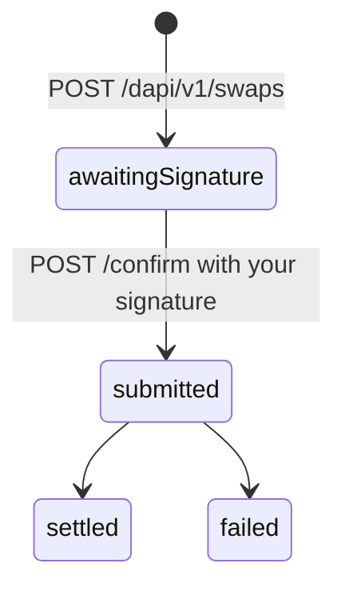

import ActingAsSnippet from "/snippets/acting-as.mdx";
import ConfirmLoopSnippet from "/snippets/confirm-loop.mdx";
import IdempotencySnippet from "/snippets/idempotency.mdx";
import SignPayloadSnippet from "/snippets/sign-payload.mdx";

A swap moves money between two accounts the **same client** owns. Nobody else is paid, so there is no
contact and no beneficiary: `POST /dapi/v1/swaps` prices and reserves the move,
`POST /dapi/v1/swaps/{swapId}/confirm` authorizes it. A client holding euros that owes dollars swaps
before it pays out, and the money never leaves its own name.

<CodeGroup>
```python Python
northwind = hevn.acting_as(CLIENT_ID)

swap = northwind.post("/swaps", {
    "sourceAccount": "USDC",
    "destinationAccount": "EURC",
    "amount": "500.00",
    "publicKey": key.public_key,
}, idempotency_key="swap-A-1187")

signature = key.sign_payload(swap["approval"]["payload"])
receipt = northwind.confirm_until_settled(f"/swaps/{swap['id']}/confirm", signature)
```

```javascript Node
const northwind = hevn.actingAs(clientId);

const swap = await northwind.post("/swaps", {
  sourceAccount: "USDC",
  destinationAccount: "EURC",
  amount: "500.00",
  publicKey: key.publicKey,
}, { idempotencyKey: "swap-A-1187" });

const signature = key.signPayload(swap.approval.payload);
const receipt = await northwind.confirmUntilSettled(`/swaps/${swap.id}/confirm`, signature);
```

```go Go
northwind := api.ActingAs(clientID)

swap, err := northwind.Post("/swaps", hevn.Body{
	"sourceAccount":      "USDC",
	"destinationAccount": "EURC",
	"amount":             "500.00",
	"publicKey":          key.PublicKey,
}, hevn.IdempotencyKey("swap-A-1187"))

signature, err := key.SignPayload(swap.Str("approval.payload"))
receipt, err := northwind.ConfirmUntilSettled("/swaps/"+swap.Str("id")+"/confirm", signature)
```
</CodeGroup>

Examples use the client from [HTTP client](/whitelabel/reference/client). `acting_as` sets the header
that picks whose money moves:

<ActingAsSnippet />

## The accounts

Both sides are named from one vocabulary, the same one the balance reads back and a payout's
`sourceAccount` takes. `USDC` and `EURC` are the stablecoins on the client's wallet; `FDIC_USD` is
dollars a partner bank holds for it:

| Account | Where the money is | Currency |
| --- | --- | --- |
| `USDC` | the client's Base smart wallet | USD |
| `EURC` | the same smart wallet | EUR |
| `FDIC_USD` | a virtual account a partner bank holds for the client | USD |

The two sides must differ, and both must be accounts that client actually holds. An account it does
not hold is `422 account_unavailable` — a client with no custodial virtual account cannot name
`FDIC_USD`. A pair nothing can serve right now is `422 swap_route_unavailable`.



## Price it first

`POST /dapi/v1/swaps/preview` takes the same accounts and amount without a `publicKey`, compares
every route that can serve the pair, and answers the best one. It reserves nothing, signs nothing and
returns no `swapId`, so it is safe to call on every keystroke of a form.

<CodeGroup>
```bash cURL
curl -s -X POST "$HEVN_API/swaps/preview" \
  -H "Authorization: Bearer $HEVN_ACCESS_TOKEN" \
  -H "X-Hevn-Account: $HEVN_CLIENT_ID" \
  -H "Content-Type: application/json" \
  -d '{"sourceAccount":"USDC","destinationAccount":"EURC","amount":"500.00"}'
```

```python Python
priced = northwind.post("/swaps/preview", {
    "sourceAccount": "USDC",
    "destinationAccount": "EURC",
    "amount": "500.00",
})
```

```javascript Node
const priced = await northwind.post("/swaps/preview", {
  sourceAccount: "USDC",
  destinationAccount: "EURC",
  amount: "500.00",
});
```

```go Go
priced, err := northwind.Post("/swaps/preview", hevn.Body{
	"sourceAccount":      "USDC",
	"destinationAccount": "EURC",
	"amount":             "500.00",
})
```
</CodeGroup>

```json Response — 200
{ "sourceAccount": "USDC",
  "destinationAccount": "EURC",
  "quote": { "fromAmount": "500.00", "fromCurrency": "USDC",
             "toAmount": "462.14", "toCurrency": "EURC",
             "rate": "0.924280", "feeAmount": "0.75", "feeCurrency": "USDC",
             "minimumToAmount": "461.21", "estimated": false,
             "expiresAt": "2026-09-20T18:12:41Z" } }
```

Pin one side and one only: `amount` is what leaves the source account, `amountTo` is what has to
arrive on the destination. Sending both, or neither, is `422 validation_failed`.

`minimumToAmount` is the floor a route with slippage guarantees; `estimated: true` marks a move whose
delivered amount is only known on arrival, and then `etaHours` says how long that takes. A locked
price carries `expiresAt` and nothing else has to be read.

## Reserve and sign

`POST /dapi/v1/swaps` prices the move again, fixes it, and returns the approval to sign. The response
tells you what that approval authorizes:

| `authorization` | What it means | What else is on the response |
| --- | --- | --- |
| `debit` | the move is funded by sending tokens out of the client's wallet | `debit` — the exact address, amount and token that will leave |
| `intent` | the move is settled by HEVN against the client's own signature, with nothing leaving the wallet | `intent` — the EIP-712 `digest` of the terms being authorized |

Either way you sign `approval.payload` and post it to the same confirm route. The difference is what
HEVN does with the co-signature, not what your code does with the approval.

```json Response — 201, Location: /dapi/v1/swaps/swp_9f2c1ab84d
{ "id": "swp_9f2c1ab84d",
  "status": "awaitingSignature",
  "idempotencyKey": "swap-A-1187",
  "sourceAccount": "USDC",
  "destinationAccount": "EURC",
  "quote": { "fromAmount": "500.00", "fromCurrency": "USDC",
             "toAmount": "462.14", "toCurrency": "EURC",
             "rate": "0.924280", "feeAmount": "0.75", "feeCurrency": "USDC" },
  "authorization": "debit",
  "approval": { "id": "b1e7…", "payload": "eyJib2R5Ijp7…", "expiresAt": "2026-09-20T18:10:59Z" },
  "debit": { "address": "0x8c41…", "amount": "500.00", "amountAtomic": "500000000",
             "token": "USDC", "chainId": 8453 } }
```

When `authorization` is `debit`, check `debit` before you sign — it is decoded out of the operation
itself, not echoed from your request, and it is the one cross-check a signer has
([Signing](/whitelabel/signing)).

<SignPayloadSnippet />

Then confirm, and keep confirming while it is still in flight:

<ConfirmLoopSnippet />

A confirm answers `200` when settlement landed inside the request and `202 submitted` when it did
not; in the second case `pollUrl` names the read route. Confirm is single use: the same signature a
second time is `409 funding_attempt_expired` on a `debit` swap and `410 approval_expired` on an
`intent` one. Either way the move already happened, and the way to check on it is
`GET /dapi/v1/swaps/{swapId}`, never another confirm.

## Read it back

`GET /dapi/v1/swaps/{swapId}` carries the lifecycle, the accounts it ran between, the terms it was
fixed at, and `transactionId` once the move is on the client's ledger.

```json Response — 200
{ "id": "swp_9f2c1ab84d",
  "status": "settled",
  "sourceAccount": "USDC",
  "destinationAccount": "EURC",
  "quote": { "fromAmount": "500.00", "fromCurrency": "USDC",
             "toAmount": "462.14", "toCurrency": "EURC",
             "rate": "0.924280", "feeAmount": "0.75", "feeCurrency": "USDC" },
  "transactionHash": "0x7d2b…",
  "transactionId": "txn_5c9e2f…",
  "createdAt": "2026-09-20T18:08:44Z",
  "settledAt": "2026-09-20T18:09:12Z" }
```

A swap is not a second source of truth about money: both sides of it are ordinary ledger rows, so
`GET /dapi/v1/transactions` shows the result without reading this route at all
([Balances and transactions](/whitelabel/balances-and-transactions)).

## Retries

<IdempotencySnippet />

The key names the move. A retry with the same key returns the swap it already created, with
`Idempotency-Replayed: true`; the same key with different accounts or a different amount is
`409 idempotency_key_reused`, which is the guarantee that a repeated call is never a second
conversion.

## Paying straight out of the custodial balance

A client that holds `FDIC_USD` does not have to swap before it pays. `POST /dapi/v1/payouts` with
`"sourceAccount": "FDIC_USD"` spends that balance directly: the payout is authorized by an intent
signature instead of a debit, so the response carries `authorization: "intent"` and no `debit`, and
confirm is unchanged ([Payouts](/whitelabel/payouts)). Use a swap when the client wants the money on
its wallet, and a payout when it wants a beneficiary paid.

## In the sandbox

Swaps are the one money route the sandbox does not serve. The emulated chain has no exchange venue
behind it and the emulator issues no custodial dollar balance, so `POST /dapi/v1/swaps` there answers
a refusal rather than a quote. Build against the contract on this page and exercise it in production
([Sandbox](/whitelabel/sandbox)).

<Card title="Next: Balances and transactions" icon="arrow-right" href="/whitelabel/balances-and-transactions">
  Read a client's balance, walk its ledger with a cursor, export a statement.
</Card>
