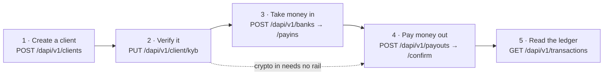
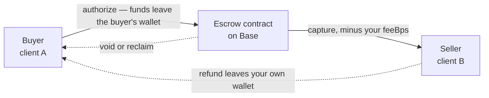

Every whitelabel integration is built from the same five moves. What makes a marketplace different
from a payroll product is which moves it uses, in what order, and who its clients are — not a
different API.

| Move | Calls | Page |
| --- | --- | --- |
| Create a client | `POST /dapi/v1/clients`, then poll `GET /dapi/v1/client` to `ready` | [Clients](/whitelabel/clients) |
| Verify it | `PUT /dapi/v1/client/kyb` until `ready: true`, then `POST /dapi/v1/client/kyb/complete` | [Onboard a client](/whitelabel/onboarding) |
| Take money in | `POST /dapi/v1/banks` opens a virtual account; `POST /dapi/v1/payins` prices an arrival | [Virtual accounts](/whitelabel/virtual-accounts), [Payins](/whitelabel/payins) |
| Pay money out | `POST /dapi/v1/contacts`, then `POST /dapi/v1/payouts` and its `/confirm` | [Payouts](/whitelabel/payouts) |
| Read the ledger | `GET /dapi/v1/transactions`, `/summary`, `/export` | [Balances and transactions](/whitelabel/balances-and-transactions) |

Only move 4 needs a signature, and it is always the same one: HEVN builds the operation, you check
the `debit` it echoes and sign it, HEVN co-signs and submits. That mechanism is described once, in
[Signing](/whitelabel/signing), and never varies by product.

## A marketplace with escrow

Your customer is a buyer paying a seller through your platform, and the money must not reach the
seller until the goods do. Both parties are clients you created; you are the operator of the deal
between them.

<Steps>
  <Step title="Create both sides as clients">
    A deal binds two accounts you provisioned yourself. A buyer or seller you merely referred to
    HEVN does not qualify — `POST /dapi/v1/escrow` answers `422 receiver_not_a_client`.
  </Step>
  <Step title="Fund the buyer">
    Whatever gets a stablecoin balance onto the buyer's wallet: a virtual account in the buyer's own
    name, or an on-chain transfer straight to `baseSmartWallet`. Crypto in needs no rail and no
    verification beyond a `ready` client.
  </Step>
  <Step title="Open the deal and authorize it">
    `POST /dapi/v1/escrow` names `senderClientId`, `receiverClientId` and the three windows —
    `approveBy`, `holdUntil`, `refundableUntil`. Authorizing moves the money out of the buyer's
    wallet into the contract, where neither party, neither HEVN nor you can spend it outside the
    contract's rules.
  </Step>
  <Step title="Capture when the seller delivers">
    `POST /dapi/v1/escrow/{escrowId}/actions` with `action: "capture"` and a `feeBps` — **that is
    your take rate**, deducted from the captured amount before the seller is paid. Capture is
    repeatable, so a partial delivery is a partial capture.
  </Step>
  <Step title="Handle the unhappy paths">
    `void` returns the hold to the buyer; `reclaim` does the same after `holdUntil` has passed;
    `refund` sends money back after a capture — **and a refund leaves your own wallet**, not the
    seller's, so keep a working balance in the deal's token.
  </Step>
</Steps>

Read `availableActions` on the deal rather than branching on `status`. The server computes it from
the amounts, the windows and what already landed on chain, so it is the only answer that accounts for
all three. Full matrix: [Escrow actions](/whitelabel/escrow-actions).

Escrow is switched on per integrator. Ask for it before you build against it —
[Going live](/whitelabel/going-live#what-hevn-must-enable).

## A payables or payroll platform

Your customer is an employer. It holds one client account, collects into it, and pays many people in
many countries out of it. Nothing here needs escrow, and the contractors are never clients.

<Steps>
  <Step title="One client per employer">
    Create it, verify it, and open the virtual account for the currency the employer funds in. From
    then on that one `cl_…` is the whole relationship.
  </Step>
  <Step title="Save each contractor as a contact">
    `POST /dapi/v1/contacts` carries the beneficiary's account details in the same shape
    `GET /dapi/v1/banks` returns them, plus a complete postal address. A contact is deduplicated by
    its own details, so a retried create never forks one. Which identifiers a method needs is in
    [Rails and payment methods](/whitelabel/reference/rails#what-each-method-needs).
  </Step>
  <Step title="Price the run before you commit to it">
    `GET /dapi/v1/contacts/{contactId}/capabilities?amount=…` reports every payable option for that
    contact with its `minAmount`, `maxAmount`, `feeBps` and `fixedFee`, and anything that would
    refuse the payout in `blockers[]`. Read it per contact and show your customer a total.
  </Step>
  <Step title="Pay, one payout at a time">
    `POST /dapi/v1/payouts` with an `Idempotency-Key` derived from your own payroll-run id and the
    contractor id — `run-2026-09/contractor-441` — then sign and confirm. That key is what makes the
    whole run safe to re-drive after a crash: a repeat is the same payment, never a second one.
  </Step>
  <Step title="Reconcile from the client's ledger">
    `GET /dapi/v1/transactions` on the employer client is the record your customer's finance team
    reads, and `GET /dapi/v1/transactions/export` renders it as a statement.
  </Step>
</Steps>

Pin the side that matters. Send `amount` when the employer's budget is fixed, `amountTo` when the
contractor's net is fixed — never both, and never re-derive the other side yourself. See
[Conventions](/whitelabel/conventions#money).

## An embedded payments account

Your customer gets what looks like a bank account inside your product: payment details in their own
company name, a balance, a statement and outgoing payments. HEVN is invisible.

<Steps>
  <Step title="A client per customer, verified once">
    The legal name you send at creation becomes the name on the account details, so send the
    registered name with its suffix — `Northwind Trading Ltd`, not `Northwind`.
  </Step>
  <Step title="A named rail, not a pooled one">
    On a `named` rail the partner bank opens the account in the client's own legal name, so the
    payer's bank shows your customer and nothing about HEVN. On a `pooled` rail the account belongs
    to the partner and a `paymentReference` is what attributes the money — fine when your product
    generates the payment instruction, wrong when a human types it.
  </Step>
  <Step title="Surface the balance from chain, not from your database">
    `GET /dapi/v1/client/balance` reads the client's Base smart wallet directly, one row per
    account. There is no HEVN ledger that holds an authoritative copy, and there should be
    no copy of yours either.
  </Step>
  <Step title="Let them pay out">
    Contacts plus payouts, exactly as above. A wallet contact on Base is paid straight from the
    balance with nothing converted; a bank contact goes through a partner and is quoted.
  </Step>
</Steps>

Re-read the account details before each use rather than caching them — a partner can republish an
account, and a stale IBAN is an unattributable wire.

## What none of these do

They do not let your customer sign. A client account has no login and no signer of its own: every
movement starts with your developer key and is co-signed by HEVN, which is the whole shape of the
whitelabel model. If what you want is an account whose owner signs for themselves, that is the
self-serve product — see [What is HEVN](/general/what-is-hevn).

<Card title="Next: Quickstart" icon="rocket" href="/whitelabel/quickstart">
  Nine steps in the sandbox, from an empty account to money that moved on chain.
</Card>
